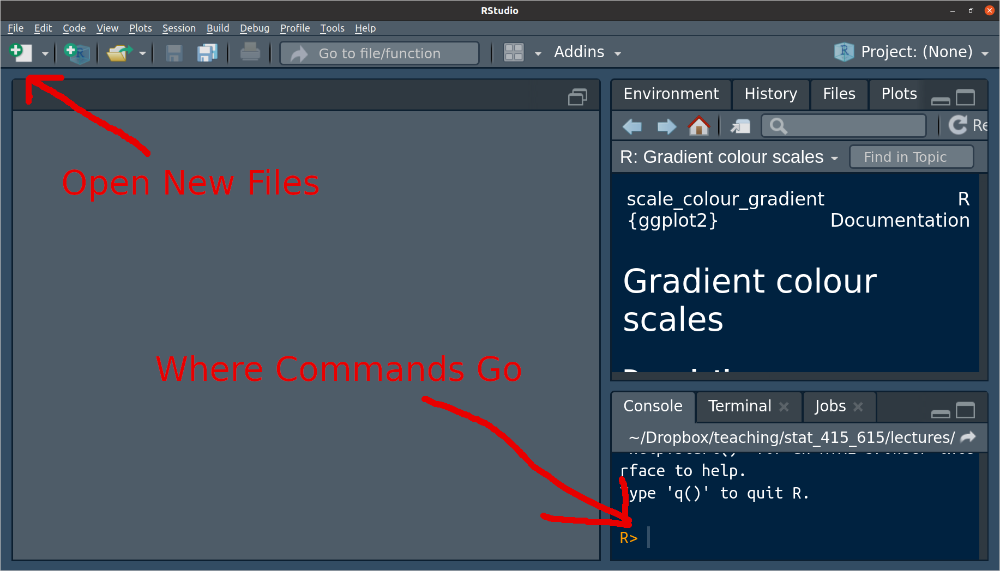
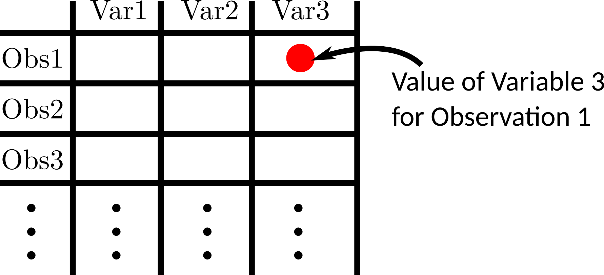

```{r setup}
#| include: false
knitr::opts_chunk$set(echo = TRUE,
            fig.width = 4, 
            fig.height = 3, 
            fig.align = "center")
ggplot2::theme_set(ggplot2::theme_bw() + ggplot2::theme(strip.background = ggplot2::element_rect(fill = "white")))
```

# Introduction

- R is a statistical programming language designed to analyze data.

- **This is not an R course**. But you need to know some tools to summarize/plot/model data.

- R is free, widely used, more generally applicable (beyond linear regression), and a useful tool for reproducibility. So this is what we will use.

- Python would have been a good choice too, but it is worse at basic stats (this is controversial).

# Installation

- Install here R : <https://cran.r-project.org/>

- Install R Studio here: <https://www.rstudio.com/>

- NOTE: R is a programming language. R Studio is an [IDE](https://en.wikipedia.org/wiki/Integrated_development_environment), a program for interacting with programming language (specifically R in this case). Thus, on your resume, you should say that you know R, *not* R Studio.

# Before we begin

- I cannot teach you everything there is to know in R. When you
know the name of a function, but don't know the commands, use
the `help()` function. For example, to learn more about `log()` type
  ```{r}
  #| eval: false
  help(log)
  ```

- Alternatively, if you do not know the name of the function, you can
Google the functionality you want. Googling coding solutions is a
lot of what real data scientists do. Just append what you are Googling with "in R". So, for example, "linear mixed effects models in R".

- Nowadays, folks also use generative AI. You are all familiar with this. I think this is fine, but make sure you understand its output. Remember, **I can call you in and reduce your grade if it spits out something weird and you can't explain it to me.**

# R Basics

- When you first open up R Studio, it should look something like this

  {fig-alt="R studio screenshot."}\ 
  
- The area to the right of the carrot "`>`" is called a **prompt**. You insert commands into the prompt.

- You can use R as a powerful calculator. Try typing some of the following into the command prompt:

  ```{r}
  #| eval: false
  3 * 7
  9 / 3
  4 + 6
  3 - 9
  (3 + 5) * 6
  3 ^ 2
  4 ^ 2
  ```

::: {.panel-tabset}
## Exercise 

What do you think the following will evaluate to? Try to guess before running it in R:
  
```{r}
#| eval: false
8 / 4 + 3 * 2 ^ 2
```

## Solution

14
:::


## R Script

- You typically don't write R code in the console, but in an R script.

- Open up an R script with File > New File > R Script 
  - Or with CTRL+SHIFT+N

- You write some R code, then evaluate it by having yoru cursor on the same line as the R code and hitting CTRL+ENTER

-   You can add *comments* (unevaluated R code) by putting a hashtag before the comment.

    ```{r}
    # This is a comment and will not be evaluated by R even if you hit CTRL+ENTER
    ```


## Variables

- R consists of two things: variables and functions (computer scientists would probably disagree with this categorization).

- A variable stores a value. You use the **assignment operator** "`<-`" to assign values to variables. For example, we can assign the value of `10` to the variable `x`.

  ```{r}
  x <- 10
  ```
  
  - It is possible to use `=`, and I think there is nothing wrong with that. But for some reason the field has decided to only use `<-`, so you should too.
  
- Whenever we use `x` later, it will use the value of 10

  ```{r}
  x
  ```
  
- This is useful because you can reuse this value over and over again:

  ```{r}
  #| eval: false
  y <- 0
  x + y
  x * y
  x / y
  x - y
  ```

- To assign a "string" (a fancy way to say a word) to `x`, put the string in quotes. For example, we can assign the value of `"Hello World"` to `x`.

  ```{r}
  x <- "Hello World"
  x
  ```

## Functions

- Functions take objects (such as numbers or variables) as input and output
  new objects. Let's look at a 
  simple function that takes the log of a number:
  
  ```{r}
  #| eval: false
  log(x = 4, base = 2)
  ```
  
- The inputs are called "arguments". Generally, every function will be for the
  form:
  
  ```{r}
  #| eval: false
  function_name(arg1 = val1, arg2 = val2, ...)
  ```

- If you do not specify the name of the argument, R will assume you are 
  assigning in their order.
  
  ```{r}
  #| eval: false
  log(4, 2)
  ```

- You can change the order of the arguments if you specify them.

  ```{r}
  #| eval: false
  log(base = 2, x = 4)
  ```

- To see the list of all possible arguments of a function, use the `help()` 
  function:
  
  ```{r}
  #| eval: false
  help(log)
  ```

- In the help file, there are often **default** values for an argument. For 
  example, the following indicates the the default value of `base` is `exp(1)`.
  
  ```{r}
  #| eval: false
  log(x, base = exp(1))
  ```
  
- This indicates that you can omit the `base` argument and R will assume that 
  it should be `exp(1)`.
  
  ```{r}
  log(x = 4, base = exp(1))
  log(x = 4)
  ```

- If an argument does not have a default, then it must be specified when calling a function.
  
- Type this:

  ```{r}
  #| eval: false
  log(x = 4,
  ```

- The "`+`" indicates that R is expecting more input (you forgot either a
  parentheses or a quotation mark). You can get back to the prompt by hitting
  the ESCAPE key.
  
## Useful Functions

- `c()` creates a *vector* (sequence of values)

  ```{r}
  y <- c(8, 1, 3, 4, 2)
  y
  ```
  
- You can perform vectorized operations on these vectors
  ```{r}
  y + 2
  y / 2
  y - 2
  ```
  
- `exp()`: Exponentiation. This is the inverse of `log()`.

  ```{r}
  exp(10)
  log(exp(10))
  ```
  
- `sqrt()`: Square root

  ```{r}
  sqrt(9)
  ```
  
- `mean()`: The mean of a vector

  ```{r}
  mean(y)
  ```

- `sd()` The standard deviation of a vector

  ```{r}
  sd(y)
  ```
  
- `sum()`: Sum the values of a vector.

  ```{r}
  sum(y)
  ```

- `seq()`: Create a sequence of numbers

  ```{r}
  seq(from = 1, to = 10)
  ```

- `head()`: Show the first six values of an object.


::: {.panel-tabset}
## Exercise
Calculate this in R (*hint*: `pi` is $\pi$ in R)
$$
\frac{1}{\sqrt{2\pi}}e^{-1.3^2}
$$

## Solution
```{r}
exp(-1.3^2) / sqrt(2 * pi)
```

:::


::: {.panel-tabset}
## Exercise
 Create the following vector $x = (1, -2, 1.3)$. What is the mean and standard deviation of this variable?

## Solution
```{r}
x <- c(1, -2, 1.3)
mean(x)
sd(x)
```

:::


::: {.panel-tabset}
## Exercise
Create a vector from 1 to 1000, take ths square root of each element, then sum them up.

## Solution
```{r}
sum(sqrt(seq(1, 1000)))
```

:::

::: {.panel-tabset}
## Exercise
What does the `by` argument do in `seq()`? Try it out.

## Solution
Creates increments of 2 instead of 1.
```{r}
seq(1, 10, by = 2)
```

:::
  
## R Packages

- A **package** is a collection of functions that don't come with R by default.

- There are **many many** packages available. If you need to do any data
  analysis, there is probably an R package for it.

- Using `install.packages()`, you can install packages that contain functions 
  and datasets that are not available by default. Do this now with the 
  `{tidyverse}` and `{broom}` packages
  
  ```{r}
  #| eval: false
  install.packages("tidyverse")
  install.packages("broom")
  ```

- You will only need to install a package once per computer. Once it is 
  installed you can gain access to all of the functions and datasets in a
  package by using the `library()` function. 
  
  ```{r}
  #| message: false
  library(tidyverse)
  ```

- You will need to run `library()` at the start of every R session if you 
  want to use the functions in a package.
  
- When I want to write the name of a function, I will write it like `this()`.

## Data Frames

- The fundamental unit object of data analysis is the **data frame**.

- A data frame has variables in the columns, and observations in the rows. 

  {width=50% fig-alt="Data frame visualization."}\ 
  
- R comes with a bunch of famous datasets in the form of a data frame. Such as the `airquality` dataset, which contains daily air quality measurements in New York from 1973.

  ```{r}
  data("airquality")
  head(airquality)
  ```
  
- You can extract individual variables from a data frame using `$`

  ```{r}
  airquality$Ozone
  ```

- You can explore these in a spreadsheet format using `View()` (note the capital "V"). Don't ever have this in a file though, directly write it in the console.

  ```{r}
  #| eval: false
  view(airquality)
  ```

## Reading in Data Frames

- Most datasets will nead to be loaded into R. To do so, we will use the `{readr}` package. This is loaded automatically when you load the tidyverse, so we don't need to do it again for now.

- The only function I will require you to know from this package is `read_csv()`, which loads in data from a [CSV file](https://en.wikipedia.org/wiki/Comma-separated_values) ("Comma-separated values"), a very popular format for storing data.

- If you have the CSV file somewhere on your computer, then specify the path from the current working directory, and assign the data frame to a variable.

- For other file formats, you need to use other functions, such as `read_tsv()`, `read_table()`, `read_fwf()`, etc. I will try to make sure `read_csv()` works for all datasets in this course.

- I will typicaly post course datasets at <https://dcgerard.github.io/stat_302/data.html>. You can load those data into R by pasting their URL's into `read_csv()`.

-   For this lecture, let's consider the data [ex1027.csv](https://dcgerard.github.io/stat_302/data.html#chapter-10), from @pimm1988risk. They were interested in if nesting pair size was related to rate of extinction. They measured the average nesting pair size and time to extinction across 16 islands for 62 bird species. They also measued the size of the species (large/small) and the migratory status of the species (migratory/resident).
  
    ```{r}
    #| message: false
    birds <- read_csv("https://dcgerard.github.io/stat_302/data/ex1027.csv")
    head(birds)
    ```
  
::: {.panel-tabset}
## Exercise
Load in the "ex0223.csv" data from the [course website](https://dcgerard.github.io/stat_302/data.html#chapter-2). Call the resulting data frame `highway`.

## Solution

```{r}
#| eval: true
highway <- read_csv("https://dcgerard.github.io/stat_302/data/ex0223.csv")
head(highway)
```

:::

## Basic Data Frame Manipulations

- You will need to know just a few data frame manipulations, which we will perform using the `{dplyr}` package. This is already loaded into R if you loaded in the `{tidyverse}`.
  
- The first argument for `{dplyr}` functions is always the data frame you are modifying. The following arguments typically involve the columns of that data frame.

-   Use the `mutate()` function from the `{dplyr}` package to make variable transformations.

    ```{r}
    birds <- mutate(birds, log_time = log(Time))
    head(birds)
    ```

-   Use `glimpse()` to get a brief look at the data frame.

    ```{r}
    glimpse(birds)
    ```

-   Use `view()` to see a spreadsheet of the data frame (**never** put this in a Quarto file).
  
    ```{r}
  #| eval: false
    view(birds)
    ```

-   Use `rename()` to rename variables.

    ```{r}
    birds <- rename(birds, l_time = log_time)
    head(birds)
    ```

-   Use `filter()` to remove rows.

    - Use `==` to select rows based on equality
    - Use `<` and `>` to select rows based on inequality
    - Use `<=` and `>=` to select rows based on inequality/equality.
  
    ```{r}
    filter(birds, Size == "L")
    
    filter(birds, Pairs < 2)  
    
    filter(birds, Size == "L", Pairs < 2) # both conditions met
    ```
  
::: {.panel-tabset}
## Exercise

In the highway data, calculate the ratio of 1996 to 1995 fatalities.

## Solution
```{r}
highway <- mutate(highway, ratio = Fatalities1996 / Fatalities1995)
glimpse(highway)
```
:::

::: {.panel-tabset}
## Exercise
Even though it is already in the data frame, you can calculate the percent change yourself by taking the ratio, subtracting 1, and multiplying by 100. Do so now. Call the new variable `PctChange_2` and compare it to `PctChange`.

## Solution

```{r}
highway <- mutate(highway, PctChange_2 = (ratio - 1) * 100)
glimpse(highway)
```
They are the same up to rounding.
:::

::: {.panel-tabset}
## Exercise
From the highway data, filter for just the states that increased the speed limit.

## Solution
```{r}
filter(highway, SpeedLimit == "Inc")
```
:::

::: {.panel-tabset}
## Exercise
From the `highway` data, filter for states that increased the speed limit and had a reduced fatality rate.

## Solution
```{r}
filter(highway, SpeedLimit == "Inc", PctChange < 0)
```
:::
  
# Summary

Here is the list of basic R stuff I expect you to know, more or less off the top of your head. We will add to this list throughout the semester.

- `help()`: Open help file.
- `install.packages()`: Install an external R package. Do this once per computer for each package.
- `library()`: Load the functions of an external R package so you can use them. Do this each time you start up R for each package.
- `<-`: Variable assignment.
- `+`, `-`, `/`, `*`: Arithmetic operations.
- `^`: Powers.
- `sqrt()`: Square root.
- `log()`: Log (base e.)
- `$`: Extracting a variable from a data frame.
- `View()`: Look at a spreadsheet of data.
- `head()`: See first six elements.
- From `{readr}`:
  - `read_csv()`: Loading in tabular data.
- From `{dplyr}`:
  - `glimpse()`: Look at a data frame.
  - `mutate()`: Variable transformation.
  - `rename()`: Variable renaming.
  - `filter()`: Select rows based on variable values.
- From `{ggplot2}` (see [01_ggplot](./01_ggplot.html)).
  - `ggplot2()`: Set a dataset and aesthetic map.
  - `geom_point()`: Make a scatterplot.
  - `geom_histogram()`: Make a histogram.
  - `geom_bar()`: Make a bar plot.
  - `geom_boxplot()`: Make a box plot.
  - `geom_smooth()`: Add a smoother.
