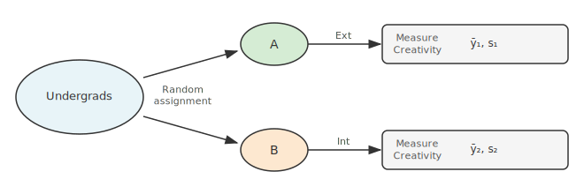
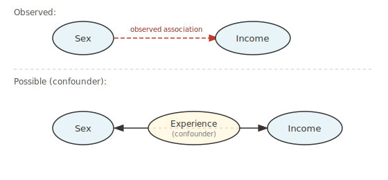
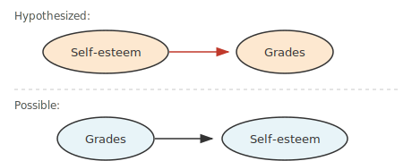
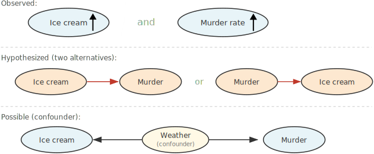
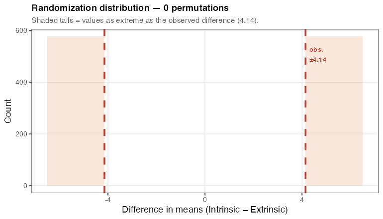

```{r setup}
#| include: false
set.seed(1)
knitr::opts_chunk$set(echo       = TRUE,
                      fig.height = 3,
                      fig.width  = 6,
                      fig.align  = "center")
ggplot2::theme_set(ggplot2::theme_bw())
```

# Learning Objectives

- Distinguish randomized experiments from observational studies.
- Understand when causation can and cannot be claimed.
- Understand when results generalize to a broader population.
- Describe the four-step general setup of statistical inference.

# Case Study 1.1.1: Creativity and Motivation

- **Design**:
  - Conscript 47 undergraduates to participate.
  - Randomly assign 24 to one group (Extrinsic motivation) and 23 to
    another (Intrinsic motivation).
  - Apply treatments to each group.
  - Measure creativity score within each group.
  - Compare creativity scores between groups.

- The key question: Can differences in average creativity be attributed
  to the random assignment?

{fig-align="center" width="90%"}

# Case Study 1.1.2: Sex Discrimination at a Bank

- **Design**:
  - Obtain all clerical employees at a bank and record their sex and income.
  - Compare mean income between the sexes.
  - Can differences be attributed to random assignment? **No** — sex is
    not determined by the investigators.

# Two Types of Study Design

- **Observational Study**:
  - No treatment is imposed on the observational units.
  - Goal: describe (or infer) properties of a population.
  - Case 1.1.2 is an example.
  - **Cannot claim causation.**
    - A third variable (a **confounder**) might cause the observed
      association between the two variables of interest.
    - Example: Sex and income have an observed association, but experience
      might cause both higher income and be associated with sex.

{fig-align="center" width="80%"}

- **Side note** — other ways causation can be mis-attributed:
  - Hypothesized: self-esteem $\to$ grades; possible: grades $\to$
    self-esteem.

{fig-align="center" width="70%"}

  - Observed: ice cream sales and murder rates both rise together;
    possible explanation: weather $\to$ ice cream sales *and* weather
    $\to$ murder rate.

{fig-align="center" width="90%"}

- Causation **can never be fully proven** by an observational study.

- **Randomized Experiment**:
  - Treatment is randomly assigned to observational units.
  - Case 1.1.1 is an example.
  - **Can infer causation.**
  - Why? All other variables (confounders) are balanced *on average*
    across groups because of random assignment.
    - E.g., it is possible by chance to place all good writers in the
      Intrinsic group, but it is unlikely because we assigned randomly.

- **Why do observational studies anyway?**
  1. Goal is prediction, not causation. Confounding variables can still
     be conditioned on.
  2. Combined with scientific reasoning they can establish causation
     (e.g., smoking and cancer, animal trials).

# Generalizability

- **How are observational units selected?**
  - **Random sampling**: results are generalizable to the population.
  - **Non-random sampling**: scope of inference is limited.

- Random sampling makes the sample look like the population — same
  percent women, race, experience level, etc.

- Example — Case 1.1.1: only good writers were recruited, so results may
  only hold for good writers.

# Summary Table

| | **Randomized Experiment** | **Observational Study** |
|---|---|---|
| **Random selection** | Causation; generalizable | Association; possibly not generalizable |
| **Non-random selection** | Causation; not generalizable | Association; not generalizable |

# General Setup of Statistical Inference

- **Step 1: Posit a model with population parameters.**
  - Parameters describe aspects of the population we are interested in.
  - Let $Y_i$ = creativity score of subject $i$ in the Extrinsic group.
  - Let $Y_i^*$ = creativity score of subject $i$ in the Intrinsic group.
  - **Additive treatment effect model**:
    $$Y_i^* = Y_i + \delta$$
  - $\delta$ is a parameter, the same for all individuals.
  - $\delta > 0 \Rightarrow$ Intrinsic improves creativity.
  - $\delta < 0 \Rightarrow$ Extrinsic improves creativity.
  - $\delta = 0 \Rightarrow$ No effect.

- **Step 2: Set interpretable hypotheses in terms of parameters.**
  $$H_0: \delta = 0 \qquad H_A: \delta \neq 0$$
  - The null hypothesis represents the "simpler state of affairs."

- **Step 3: Choose a test statistic.**
  - A **test statistic** is a function of the sample used to measure
    the plausibility of a hypothesis.
  - Under $H_0$, we expect $\bar{Y}_1 \approx \bar{Y}_2$, so a natural
    test statistic is:
    $$\text{test statistic} = \bar{Y}_2 - \bar{Y}_1$$

- **Step 4: Evaluate how rare our test statistic is under $H_0$.**
  - Look at **null distribution** of test statistic: Distribution of test statistic if $H_0$ were true.
    - In the case of a randomized experiment, this is the **randomization distribution**: re-assign treatment labels at random many times and compute the test statistic each time.
  - **p-value**: the probability of observing a test statistic as
    extreme or more extreme than what we observed, *assuming $H_0$ is
    true*.
  - Small p-values provide evidence against $H_0$.

# Randomization Distribution

## Exploratory Data Analysis

```{r case0101-eda}
#| message: false
library(tidyverse)
library(broom)

case0101 <- read_csv("https://dcgerard.github.io/stat_302/data/case0101.csv")
ggplot(case0101, aes(x = Treatment, y = Score)) +
  geom_boxplot(coef = Inf) +
  geom_jitter(width = 0.1, alpha = 1/2) +
  xlab("Treatment") +
  ylab("Creativity Score")
```

## Observed Difference

```{r obs-diff}
ext_scores <- case0101$Score[case0101$Treatment == "Extrinsic"]
int_scores <- case0101$Score[case0101$Treatment == "Intrinsic"]
obs_diff <- mean(int_scores) - mean(ext_scores)
obs_diff
```

The intrinsic group scored `r round(obs_diff, 3)` points higher on average.
Is this a big difference or a small one? Two possibilities:

1. $H_A$: There is a genuine effect of treatment on creativity.
2. $H_0$: There is no effect. The observed difference happened purely
   because, by chance, the intrinsic group happened to contain more
   creative people after random assignment.

## Logic of the Randomization Test

- Under $H_0$, each person's creativity score is fixed — it would have
  been the same no matter which group they were assigned to.
- The only source of variability between group means is the random
  assignment itself.
- We can simulate this: take the observed scores, randomly shuffle
  the treatment labels, and recompute the difference in means. This
  is one **permutation** of the data.
- Repeating this many times gives the **randomization distribution**:
  the distribution of differences we would see by chance alone if
  $H_0$ were true.

## One Permutation

```{r one-perm}
set.seed(2)
new_assign <- sample(case0101$Treatment)
mean(case0101$Score[new_assign == "Intrinsic"]) -
  mean(case0101$Score[new_assign == "Extrinsic"])
```

Each permutation gives a different simulated difference. Most are
near zero — the null hypothesis says there is no real effect.

## Building the Randomization Distribution

```{r perm-loop}
set.seed(1)
itermax <- 5000
diffvec <- numeric(itermax)
for (i in seq_len(itermax)) {
  new_assign  <- sample(case0101$Treatment)
  diffvec[i]  <- mean(case0101$Score[new_assign == "Intrinsic"]) -
                 mean(case0101$Score[new_assign == "Extrinsic"])
}
```

The animation below shows the distribution being built up one
permutation at a time. The **red dashed lines** mark $\pm$ `r round(obs_diff, 2)`,
the observed difference. The **shaded tails** are the region as extreme
or more extreme than what we observed — each permutation landing there
counts toward the p-value.

```{r rand-dist-gif}
#| echo: false
#| message: false
#| warning: false

# Fixed histogram bins — defined unconditionally because rand-dist-final uses breaks
bw     <- 0.4
lo     <- -6.5
hi     <-  6.5
breaks <- seq(lo, hi, by = bw)

if (!file.exists("01_fig/fig_rand_dist.gif")) {
  library(gifski)

  # Pre-compute y-axis ceiling from the full distribution
  ymax <- max(hist(diffvec, breaks = breaks, plot = FALSE)$counts) * 1.12

  # Frame schedule: repeated values = longer pause on that state
  frame_schedule <- c(
    seq(0, 1000, by = 50),
    seq(1000, 5000, by = 200),                  # rapid fill-up
    rep(5000, 15)                              # 2.25 s pause on final
  )

  tmp_dir   <- tempdir()
  png_files <- character(length(frame_schedule))

  for (fi in seq_along(frame_schedule)) {
    n <- frame_schedule[fi]

    if (n == 0) {
      sub_txt <- paste0(
        "Shaded tails = values as extreme as the observed difference (",
        round(obs_diff, 2), ")."
      )
    } else {
      running_p <- mean(abs(diffvec[1:n]) >= abs(obs_diff))
      sub_txt   <- paste0(
        "Running two-sided p-value: ",
        round(running_p, 3),
        if (n == 5000) paste0("   (final answer: ", round(running_p, 3), ")") else ""
      )
    }

    p <- ggplot() +
      # Shaded tails (always visible so viewers know what we are counting)
      annotate("rect",
               xmin =  abs(obs_diff), xmax = hi,  ymin = 0, ymax = ymax,
               fill = "#e07b3a", alpha = 0.18) +
      annotate("rect",
               xmin = lo, xmax = -abs(obs_diff), ymin = 0, ymax = ymax,
               fill = "#e07b3a", alpha = 0.18)

    if (n > 0) {
      p <- p + geom_histogram(
        data    = data.frame(x = diffvec[1:n]),
        mapping = aes(x = x),
        breaks  = breaks,
        fill    = "#4a90d9", color = "white", alpha = 0.85
      )
    }

    p <- p +
      # Observed difference lines
      geom_vline(xintercept =  abs(obs_diff),
                 color = "#c0392b", linewidth = 1.1, linetype = "dashed") +
      geom_vline(xintercept = -abs(obs_diff),
                 color = "#c0392b", linewidth = 1.1, linetype = "dashed") +
      # Label
      annotate("text",
               x = abs(obs_diff) + 0.15, y = ymax * 0.88,
               label = paste0("obs.\n±", round(obs_diff, 2)),
               hjust = 0, color = "#c0392b", size = 3.2, fontface = "bold") +
      coord_cartesian(xlim = c(lo, hi), ylim = c(0, ymax)) +
      labs(
        title    = paste0("Randomization distribution — ", n, " permutations"),
        subtitle = sub_txt,
        x        = "Difference in means (Intrinsic − Extrinsic)",
        y        = "Count"
      ) +
      theme_bw(base_size = 12) +
      theme(
        plot.title       = element_text(size = 12, face = "bold"),
        plot.subtitle    = element_text(size = 10, color = "#555555"),
        panel.grid.minor = element_blank()
      )

    fname          <- file.path(tmp_dir, sprintf("rnd_frame_%04d.png", fi))
    ggsave(fname, p, width = 7, height = 4, dpi = 110)
    png_files[fi]  <- fname
  }

  gifski(png_files,
         gif_file = "01_fig/fig_rand_dist.gif",
         width = 770, height = 440, delay = 0.15)
}
```

{fig-align="center" width="95%"}

## Computing the P-value

The p-value is the proportion of permutations that produced a
difference as large in magnitude as what we observed.

```{r pval-one-sided}
## One-sided: what fraction were as large or larger?
mean(diffvec >= obs_diff)
```

```{r pval-two-sided}
## Two-sided: what fraction were as or more extreme in either direction?
mean(abs(diffvec) >= abs(obs_diff))
```

The observed difference of `r round(obs_diff, 2)` is very rarely
produced by chance under $H_0$. We have strong evidence to reject
$H_0$ and conclude that intrinsic motivation improves creativity
relative to extrinsic motivation.

```{r rand-dist-final}
#| echo: false
ggplot(data.frame(x = diffvec), aes(x = x)) +
  annotate("rect",
           xmin =  abs(obs_diff), xmax = 6.5, ymin = 0, ymax = Inf,
           fill = "#e07b3a", alpha = 0.2) +
  annotate("rect",
           xmin = -6.5, xmax = -abs(obs_diff), ymin = 0, ymax = Inf,
           fill = "#e07b3a", alpha = 0.2) +
  geom_histogram(breaks = breaks, fill = "#4a90d9",
                 color = "white", alpha = 0.85) +
  geom_vline(xintercept = c(-abs(obs_diff), abs(obs_diff)),
             color = "#c0392b", linewidth = 1.1, linetype = "dashed") +
  annotate("text",
           x = abs(obs_diff) + 0.15, y = 55,
           label = paste0("obs. diff.\n= +", round(obs_diff, 2)),
           hjust = 0, color = "#c0392b", size = 3.5, fontface = "bold") +
  annotate("text", x = 0, y = 55,
           label = paste0("p-value ≈ ",
                          round(mean(abs(diffvec) >= abs(obs_diff)), 3)),
           color = "#333333", size = 4, fontface = "bold") +
  coord_cartesian(xlim = c(-6.5, 6.5)) +
  labs(x = "Difference in means (Intrinsic − Extrinsic)",
       y = "Count",
       title = "Randomization distribution (5,000 permutations)") +
  theme_bw(base_size = 12) +
  theme(panel.grid.minor = element_blank())
```

# Permutation Distribution

- In observational studies, we can still randomly shuffle the group labels.
  - But it is no longer simulating the random allocation of treatments.
  - Rather, it simulates under a ficticous model where the employer randomly allocates preset salaries to individuals.

- In practice, you still apply the exact same procedure as above
  - Randomly allocate group labels, calculate average difference between groups, build up a **permutation distribution**.
  - Compare the observed average difference to this permutation distribution.

-   EDA:
    ```{r}
    #| message: false
    case0102 <- read_csv("https://dcgerard.github.io/stat_302/data/case0102.csv")
    ggplot(case0102, aes(x = Sex, y = Salary)) +
      geom_boxplot(coef = Inf) +
      geom_jitter(width = 0.1, alpha = 1/2)
    ```

-   Observed difference
    ```{r}
    obs_diff <- mean(case0102$Salary[case0102$Sex == "Male"]) -
      mean(case0102$Salary[case0102$Sex == "Female"])
    obs_diff
    ```
  

-   Build up permutation distribution:

    ```{r}
    set.seed(1)
    itermax <- 5000
    diffvec <- numeric(itermax)
    for (i in seq_len(itermax)) {
      new_assign  <- sample(case0102$Sex)
      diffvec[i]  <- mean(case0102$Salary[new_assign == "Male"]) -
                     mean(case0102$Salary[new_assign == "Female"])
    }
    ```

-   The p-value is about 0:

    ```{r perm-dist-final}
    #| echo: false
    ggplot(data.frame(x = diffvec), aes(x = x)) +
      geom_histogram(fill = "#4a90d9",
                     color = "white", alpha = 0.85, bins = 30) +
      geom_vline(xintercept = obs_diff, color = "#E69F00", lty = 2)
    ```


-   In practice, you would use a $t$-test to approximate this permutation distribution (Chapter 2).

    ```{r}
    t.test(Salary ~ Sex, data = case0102) |>
      tidy()
    ```

- The $p$-value is about 0.000000371. In practice, we would just report this as, like, $p < 0.001$.

- This indicates strong evidence that salaries were not assigned randomly.

- A more detailed analysis would have to account for various confounding factors, like education, years of experience, etc.
  - Even such a more detailed analysis alone could not prove causality by itself.

