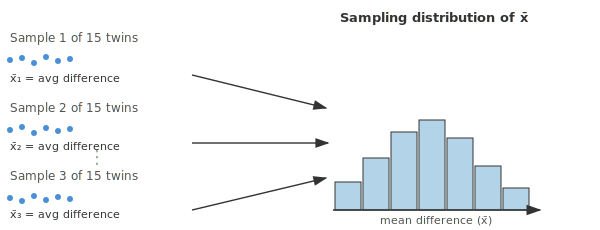
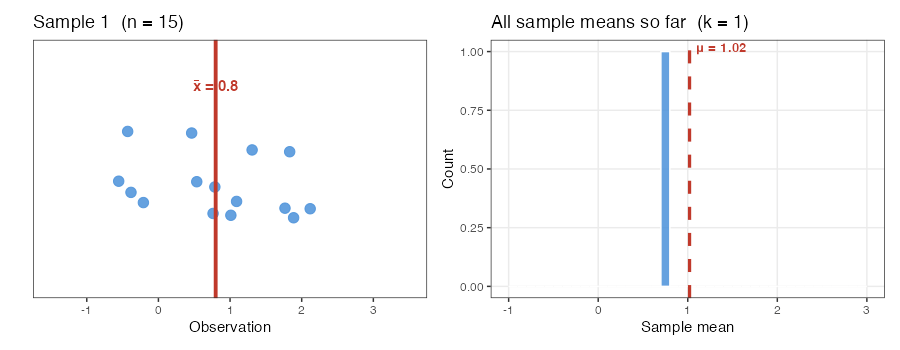
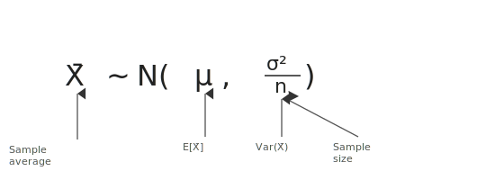
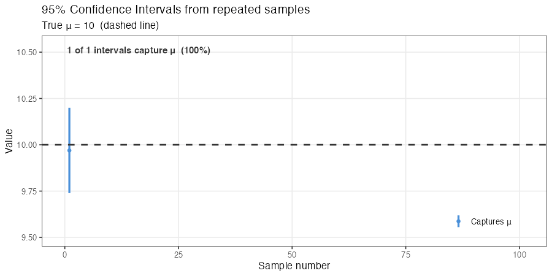

```{r setup}
#| include: false
set.seed(1)
knitr::opts_chunk$set(echo       = TRUE,
                      fig.height = 3,
                      fig.width  = 6,
                      fig.align  = "center")
ggplot2::theme_set(ggplot2::theme_bw())
```

# Learning Objectives

- Describe the sampling distribution and the Central Limit Theorem.
- Carry out paired and two-sample $t$-tests in R.
- Construct and interpret confidence intervals for a mean difference.
- Know when to use one-sided tests and non-zero nulls.

# Paired $t$-Test (§2.2)

- **Case Study 2.2**: Hippocampus volumes measured on 15 twins where
  one twin had schizophrenia and the other did not.
  - Mean difference = 0.199; is this difference real or random?
  - We can frame this as a one-sample problem on the *differences*.

## Sampling Distributions and the CLT

- **Sampling distribution**: the distribution of a statistic (e.g.,
  $\bar{X}$) over many hypothetical random samples from the population.
  - Imagine taking many samples of 15 twins and computing the average
    difference each time.
  - In practice we only take *one* sample — statistical theory tells us
    about the shape of the sampling distribution without repeating the
    study.

{fig-align="center" width="90%"}

The animation below shows this process in action. The **left panel** displays the 15 observations from sample $k$, with the sample mean $\bar{X}$ marked in red. The **right panel** accumulates every sample mean seen so far into a histogram. As more samples pile up, the histogram fills in and its shape converges to the normal distribution predicted by the CLT.

```{r samp-dist-gif}
#| echo: false
#| message: false
#| warning: false
library(gifski)
library(ggplot2)
library(patchwork)

set.seed(1)
pop    <- rt(100, df = 10) + 1
pop_mu <- mean(pop)
n_obs  <- 15
n_tot  <- 500

all_samps <- replicate(n_tot, sample(pop, size = n_obs))
all_means <- colMeans(all_samps)

# Pre-compute fixed jitter y-positions so repeated frames don't shake
set.seed(7)
jitter_y <- matrix(runif(n_obs * n_tot, -0.28, 0.28), nrow = n_obs, ncol = n_tot)

# Each of the first 5 samples lingers; later ones flash by; long final pause
frame_schedule <- c(
  rep(1, 6), rep(2, 6), rep(3, 6), rep(4, 6), rep(5, 6),
  seq(10, 500, by = 10),
  rep(500, 20)
)

tmp_dir   <- tempdir()
png_files <- character(length(frame_schedule))

for (fi in seq_along(frame_schedule)) {
  n            <- frame_schedule[fi]
  cur_samp     <- all_samps[, n]
  cur_mean     <- all_means[n]
  means_so_far <- all_means[1:n]

  obs_df <- data.frame(obs = cur_samp, ypos = jitter_y[, n])

  p_obs <- ggplot(obs_df, aes(x = obs, y = ypos)) +
    geom_point(color = "#4a90d9", size = 3.2, alpha = 0.85) +
    geom_vline(xintercept = cur_mean,
               color = "#c0392b", linewidth = 1.3) +
    annotate("text", x = cur_mean, y = 0.55,
             label = paste0("x̅ = ", round(cur_mean, 2)),
             hjust = 0.5, color = "#c0392b",
             size = 3.8, fontface = "bold") +
    coord_cartesian(xlim = c(-1.5, 3.5), ylim = c(-0.65, 0.75)) +
    labs(title = paste0("Sample ", n, "  (n = ", n_obs, ")"),
         x = "Observation", y = "") +
    theme_bw(base_size = 11) +
    theme(axis.text.y  = element_blank(),
          axis.ticks.y = element_blank(),
          panel.grid   = element_blank()) +
    xlim(-1, 3)

  p_hist <- ggplot(data.frame(m = means_so_far), aes(x = m)) +
    geom_histogram(breaks = seq(-1, 3, by = 0.1),
                   fill = "#4a90d9", color = "white", alpha = 0.85) +
    geom_vline(xintercept = pop_mu,
               color = "#c0392b", linewidth = 1.1, linetype = "dashed") +
    annotate("text", x = pop_mu + 0.07, y = Inf,
             label = paste0("μ = ", round(pop_mu, 2)),
             hjust = 0, vjust = 1.4,
             color = "#c0392b", size = 3.5, fontface = "bold") +
    coord_cartesian(xlim = c(-1, 3)) +
    labs(title = paste0("All sample means so far  (k = ", n, ")"),
         x = "Sample mean", y = "Count") +
    theme_bw(base_size = 11) +
    theme(panel.grid.minor = element_blank()) +
    xlim(-1, 3)

  fname <- file.path(tmp_dir, sprintf("sdist_%04d.png", fi))
  ggsave(fname, p_obs + p_hist, width = 9, height = 3.5, dpi = 100)
  png_files[fi] <- fname
}

gifski(png_files, gif_file = "02_fig/fig_sampling_dist.gif",
       width = 900, height = 350, delay = 0.25)
```

{fig-align="center" width="95%"}

- **Central Limit Theorem**: The sampling distribution of the sample
  mean is approximately normal for sufficiently large $n$, regardless of
  the distribution of individual observations.

- **Key result**: If population mean $= \mu$ and population SD $= \sigma$, then
  $$\bar{X} \;\sim\; N\!\left(\mu,\, \frac{\sigma^2}{n}\right)$$
  This is useful because it tells us how extreme our observed $\bar{X}$ is.

{fig-align="center" width="80%"}

## General Setup for the Paired $t$-Test

1. **Model**: $E[\bar{X}] = \mu$ (the expected mean difference is $\mu$).

2. **Hypotheses**:
   $$H_0: \mu = 0 \quad \text{(no difference)} \qquad
     H_A: \mu \neq 0 \quad \text{(some difference)}$$

3. **Test statistic**: Standardize $\bar{X}$. If $\sigma$ were known:
   $$Z = \frac{\bar{X}}{\sigma/\sqrt{n}} \sim N(0, 1)$$
   Under $H_0$, the shaded tails of $N(0,1)$ provide evidence against $H_0$.

4. **Problem**: $\sigma^2$ is unknown.
   - **Solution**: Estimate $\sigma^2$ with the sample variance $s^2$.
   - Substituting $s$ for $\sigma$ introduces extra uncertainty, so we
     use the $t$-distribution instead of $N(0,1)$:
     $$T = \frac{\bar{X}}{s/\sqrt{n}} \;\sim\; t_\nu \quad
       \text{where } \nu = n - 1 \text{ ("degrees of freedom")}$$

- **Why use $t$ instead of $N(0,1)$?**
  - Estimating $\sigma^2$ adds uncertainty.
  - The $t$-distribution has heavier tails than $N(0,1)$.
  - Using $N(0,1)$ would make you over-confident in the wrongness of
    $\bar{X}$.

```{r t-vs-normal-plot}
#| echo: false
#| message: false
library(tidyverse)
library(broom)
xseq <- seq(-4, 4, length.out = 300)
data.frame(
  x    = c(xseq, xseq, xseq),
  y    = c(dt(xseq, df = 4), dt(xseq, df = 14), dnorm(xseq)),
  dist = rep(c("t (df=4)", "t (df=14)", "Normal"), each = length(xseq))
) |>
  ggplot(aes(x = x, y = y, color = dist, lty = dist)) +
  geom_line(lwd = 1) +
  ggthemes::scale_color_colorblind() +
  labs(x = "x", y = "Density", color = NULL, lty = NULL) +
  theme(legend.position = "inside", legend.position.inside = c(0.8, 0.7))
```

## Applying the Paired $t$-Test: Twin Study

- $\bar{X} = 0.199$, $s/\sqrt{n} = 0.0615$, $\nu = n - 1 = 14$.
- $T = 0.199 / 0.0615 = 3.236$. Compare to $t_{14}$.

```{r twins-pvalue-plot}
#| echo: false
tstar <- 3.236
nu    <- 14
xseq  <- seq(-4.5, 4.5, length.out = 500)
data.frame(x = xseq, y = dt(xseq, df = nu)) |>
  ggplot(aes(x, y)) +
  geom_line() +
  geom_area(data = ~ subset(.x, x <= -tstar), fill = "steelblue", alpha = 0.6) +
  geom_area(data = ~ subset(.x, x >=  tstar), fill = "steelblue", alpha = 0.6) +
  annotate("text", x = -3.8, y = 0.03, label = "0.003", size = 3) +
  annotate("text", x =  3.8, y = 0.03, label = "0.003", size = 3) +
  labs(x = "t", y = "Density",
       title = paste0("t distribution (df = ", nu, "), p-value = 0.006"))
```

- p-value $= 0.006$: very strong evidence that $H_0$ is false.

```{r case0202-ttest}
#| message: false
library(Sleuth3)

data("case0202")
case0202 |>
  mutate(diff = Unaffected - Affected) ->
  twins

t.test(twins$diff) |>
  tidy() |>
  select(estimate, statistic, p.value, conf.low, conf.high)
```

# Confidence Interval for the Mean Effect

- **Question**: What are plausible values for $\mu$?

- Use the general result: $\dfrac{\bar{X} - \mu}{s/\sqrt{n}} \sim t_{n-1}$.

- In 95% of samples, the following holds:
  $$t_{n-1}(0.025) \;\leq\; \frac{\bar{X} - \mu}{s/\sqrt{n}} \;\leq\; t_{n-1}(0.975)$$

- Solving for $\mu$ (and using $-t_{n-1}(0.025) = t_{n-1}(0.975)$):
  $$\bar{X} - t_{n-1}(0.975)\,\frac{s}{\sqrt{n}} \;\leq\; \mu \;\leq\;
    \bar{X} + t_{n-1}(0.975)\,\frac{s}{\sqrt{n}}$$

- **95% Confidence Interval**:
  $$\bar{X} \;\pm\; t_{n-1}(0.975)\,\frac{s}{\sqrt{n}}$$

- **Correct interpretation**: We used a procedure that would capture the
  true parameter in 95% of repeated samples.
- **Incorrect**: After sampling, there is a 95% probability the parameter
  is in this interval (it either is or isn't — we just don't know).

## Interpreting "95% Confidence"

Let $l$ and $u$ be the lower and upper bounds of a 95% CI. Which of
the following are correct?

1. The probability that $\mu$ is between $l$ and $u$ is 95%. —
   **Incorrect.** After observing the interval, $\mu$ is either inside
   it or not; no randomness remains.
2. *Prior to sampling*, the probability that our CI captures $\mu$ is
   95%. — **Correct.**
3. 95% of the population's values lie between $l$ and $u$. —
   **Incorrect.** CIs are statements about the *parameter*, not about
   individual observations.
4. A new $\bar{X}$ from a repeat sample would fall in $(l, u)$ with
   95% probability. — **Incorrect.**
5. 95% of new $\bar{X}$'s would lie between $l$ and $u$. —
   **Incorrect.**
6. We used a procedure that captures $\mu$ in 95% of repeated samples.
   — **Correct.**

The animation below makes interpretation 6 concrete. Each vertical
segment is a 95% CI from one hypothetical repeat of the study. **Blue**
intervals capture the true $\mu$; **red** ones miss it. In the long run,
about 95% are blue.

```{r ci-interp-gif}
#| echo: false
#| message: false
#| warning: false
library(gifski)

set.seed(2)
mu    <- 10
sigma <- 1
n     <- 100
nsim  <- 100

simout    <- replicate(nsim, rnorm(n = n, mean = mu, sd = sigma))
xbar_vec  <- colMeans(simout)
s_vec     <- apply(simout, 2, sd)
tstar     <- qt(0.975, df = n - 1)
lower_vec <- xbar_vec - tstar * s_vec / sqrt(n)
upper_vec <- xbar_vec + tstar * s_vec / sqrt(n)
miss      <- upper_vec < mu | lower_vec > mu

# Each of the first 5 CIs lingers; later ones appear quickly; long final pause
frame_schedule <- c(
  rep(1, 4), rep(2, 4), rep(3, 4), rep(4, 4), rep(5, 4),
  seq(8, 100, by = 2),
  rep(100, 15)
)

tmp_dir   <- tempdir()
png_files <- character(length(frame_schedule))

ylo <- min(lower_vec) - 0.015
yhi <- max(upper_vec) + 0.015

for (fi in seq_along(frame_schedule)) {
  k <- frame_schedule[fi]

  df_ci <- data.frame(
    i     = seq_len(k),
    lower = lower_vec[seq_len(k)],
    upper = upper_vec[seq_len(k)],
    xbar  = xbar_vec[seq_len(k)],
    miss  = miss[seq_len(k)]
  )

  n_miss    <- sum(df_ci$miss)
  pct_cover <- round(100 * (k - n_miss) / k, 1)

  p <- ggplot(df_ci, aes(x = i, color = miss)) +
    geom_linerange(aes(ymin = lower, ymax = upper), linewidth = 1.1) +
    geom_point(aes(y = xbar), size = 1.5) +
    geom_hline(yintercept = mu, linetype = "dashed",
               color = "#333333", linewidth = 0.9) +
    annotate("text", x = 0.5, y = yhi,
             label = paste0(k - n_miss, " of ", k,
                            " intervals capture μ  (", pct_cover, "%)"),
             hjust = 0, vjust = 1.2,
             color = "#333333", size = 3.8, fontface = "bold") +
    scale_color_manual(
      values = c("FALSE" = "#4a90d9", "TRUE" = "#c0392b"),
      labels = c("FALSE" = "Captures μ", "TRUE"  = "Misses μ"),
      name   = NULL
    ) +
    coord_cartesian(xlim = c(0, nsim + 1), ylim = c(ylo, yhi)) +
    labs(
      title    = "95% Confidence Intervals from repeated samples",
      subtitle = paste0("True μ = ", mu, "  (dashed line)"),
      x = "Sample number", y = "Value"
    ) +
    theme_bw(base_size = 12) +
    theme(panel.grid.minor        = element_blank(),
          legend.position         = "inside",
          legend.position.inside  = c(0.87, 0.12))

  fname <- file.path(tmp_dir, sprintf("ci_%04d.png", fi))
  ggsave(fname, p, width = 9, height = 4.5, dpi = 100)
  png_files[fi] <- fname
}

gifski(png_files, gif_file = "02_fig/fig_ci_interpretation.gif",
       width = 900, height = 450, delay = 0.25)
```

{fig-align="center" width="95%"}

# Two-Sample $t$-Test (§2.1)

- **Case Study 2.1.1**: Beak depths measured on Daphne Major finches in
  1976 (before a drought) and in 1978 (after a drought).
  - Goal: still to explore differences in population means, but now we
    have **two independent samples**.

```{r finch-plot}
data("case0201")
case0201 |>
  mutate(Year = factor(Year)) ->
  finch

ggplot(finch, aes(x = Year, y = Depth)) +
  geom_boxplot(coef = Inf) +
  geom_jitter(width = 0.1, alpha = 1/3) +
  xlab("Year") +
  ylab("Beak Depth (mm)")
```

## General Setup for the Two-Sample $t$-Test

1. **Model**:
   - Let $X_1, \ldots, X_{n_1}$ = beak depths in 1976.
   - Let $Y_1, \ldots, Y_{n_2}$ = beak depths in 1978.
   $$X_i = \mu_1 + \varepsilon_i \qquad \varepsilon_i \sim (0, \sigma_1^2)$$
   $$Y_j = \mu_2 + \delta_j \qquad \delta_j \sim (0, \sigma_2^2)$$

2. **Hypotheses**:
   $$H_0: \mu_1 = \mu_2 \quad \text{(same mean beak depth)} \qquad
     H_A: \mu_1 \neq \mu_2$$

3. **Test statistic**: $\bar{X} - \bar{Y}$.
   - Values further from 0 support a bigger difference.

4. **Null distribution**: Under $H_0$,
   $$\bar{X} - \bar{Y} \;\sim\; N\!\left(0,\; \frac{\sigma_1^2}{n_1} + \frac{\sigma_2^2}{n_2}\right)
   \quad\Rightarrow\quad
   \frac{\bar{X} - \bar{Y}}{\sqrt{\sigma_1^2/n_1 + \sigma_2^2/n_2}} \;\sim\; N(0,1)$$

- **Problem**: $\sigma_1^2$ and $\sigma_2^2$ are unknown.
- **Solution**: Replace with $s_1^2$ and $s_2^2$:
  $$T = \frac{\bar{X} - \bar{Y}}{\sqrt{s_1^2/n_1 + s_2^2/n_2}} \;\sim\; t_\nu$$
  where $\nu$ is given by the Satterthwaite approximation (computed
  automatically by R).

- **p-value**:
  $$p\text{-value} = \Pr(|T| \geq |t^*|) \quad \text{where } T \sim t_\nu$$
  Small p-values provide evidence against $H_0$.

- **95% Confidence Interval** for $\mu_1 - \mu_2$:
  $$(\bar{X} - \bar{Y}) \;\pm\; t_\nu(0.975)\sqrt{\frac{s_1^2}{n_1} + \frac{s_2^2}{n_2}}$$

```{r finch-ttest}
tout <- t.test(Depth ~ Year, data = finch)
tidy(tout) |>
  select(estimate, statistic, p.value, conf.low, conf.high)
```

# Some Things to Think About

## 1. One-Sided Tests

- Sometimes the alternative is directional:

  |  | Left-sided | Right-sided |
  |---|---|---|
  | $H_0$ | $\mu = 0$ | $\mu = 0$ |
  | $H_A$ | $\mu < 0$ | $\mu > 0$ |

```{r one-sided-plot}
#| echo: false
#| fig-width: 7
#| fig-height: 3
library(patchwork)
xseq <- seq(-4, 4, length.out = 400)
yseq <- dt(xseq, df = 14)
df_t <- data.frame(x = xseq, y = yseq)

p1 <- ggplot(df_t, aes(x, y)) +
  geom_line() +
  geom_area(data = subset(df_t, x <= -1.8), fill = "steelblue", alpha = 0.6) +
  labs(x = "t", y = "Density", title = expression(H[A]: mu < 0))

p2 <- ggplot(df_t, aes(x, y)) +
  geom_line() +
  geom_area(data = subset(df_t, x >= 1.8), fill = "steelblue", alpha = 0.6) +
  labs(x = "t", y = "Density", title = expression(H[A]: mu > 0))

p1 + p2
```

- Always report whether a p-value is one-sided or two-sided.

## 2. Non-Zero Nulls

- Test $H_0: \mu = a$ vs $H_A: \mu \neq a$ using:
  $$t^* = \frac{\bar{X} - a}{s/\sqrt{n}} \;\sim\; t_{n-1}$$

  In R: `t.test(x, mu = a)`.

## 3. "Significance"

- A p-value $\leq 0.05$ is not magical. Arbitrary cutoffs should not
  drive scientific conclusions.
- See the XKCD comic on significance.

## 4. Reporting

- When reporting p-values, always also report either the sample size,
  the confidence interval, or both.
