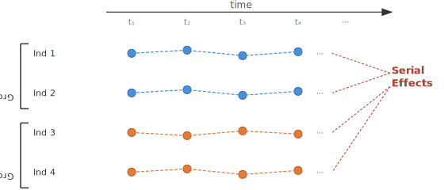

```{r setup}
#| include: false
set.seed(6)
knitr::opts_chunk$set(echo       = TRUE,
                      fig.height = 3,
                      fig.width  = 6,
                      fig.align  = "center")
ggplot2::theme_set(ggplot2::theme_bw())
```

```{r}
#| label: load-packages
#| message: false
library(tidyverse)
library(broom)
library(patchwork)
```

# Learning Objectives

- List the assumptions of the two-sample $t$-test in order of importance.
- Detect and address violations of independence.
- Detect and address violations of the equal-variance assumption.
- Detect and address non-normality (skew and outliers).
- Apply log transformations and interpret results on the original scale.

# Assumptions of 2-Sample $t$-Tools

- Assumptions in decreasing order of importance:
  1. Independence between observational units.
  2. Equal variance (if assuming $\sigma_1^2 = \sigma_2^2$).
  3. Normality (no severe skew or outliers).

- Each assumption can be checked, and solutions exist for each violation.

# 1. Independence

- **Definition**: Knowing the value of one observation does not give you
  any information about the value of another observation.

- **Example of violation — cluster effects**:
  - Measuring gene expression levels in two groups (disease vs. control).
  - Samples collected by two different technicians.
  - Technician 1 tended to produce samples with systematically higher
    levels.
  - Observations within a technician are correlated.

- **Example of violation — serial effects**:
  - Measuring expression levels on the *same* individuals over time.
  - Observations on the same person are correlated across time.

{fig-align="center" width="85%"}

- **To Detect**

  1. Think carefully about how the data were collected.
     - Were different responses measured on the same subject?
     - Were data collected in groups?
     - Were groups treated differently in ways unrelated to treatment?
  2. Residual plots (covered in Chapter 8).

- **Issues When Independence Is Violated**

  - Recall $\bar{X} - \bar{Y} \sim N(\mu_1 - \mu_2,\; \sigma_1^2/n_1 + \sigma_2^2/n_2)$.
  - If samples are not independent, the variance formula above is *too small*.
  - You have less information than you think.
  - Consequently: p-values are too small and confidence intervals are too narrow.
  
  - **Extreme example**:
    - You have 4 people. Measure each one 50 times.
    - Group 1: Person 1 always scores 0; Person 2 always scores 1.
    - Group 2: Person 3 always scores 2; Person 4 always scores 3.
    - Nominal $n = 100$ per group, but effective sample size is 2 per group.
    - Correct variance estimate: $\sigma^2 \approx 0.25 / 2 = 0.125$.
    - Incorrectly assumed variance: $\sigma^2 \approx 0.25 / 100 = 0.0025$.

- **Solutions**

  - ANOVA with blocking (Chapters 12–13) for cluster effects.
  - Longitudinal analysis (Chapter 18) for serial effects.

# 2. Unequal Variances

- Sometimes people assume $\sigma_1^2 = \sigma_2^2$ (the *pooled*
  variance $t$-test), because it generalizes more easily to more complex
  methods.

- Under the equal-variance assumption:
  $$\bar{X} - \bar{Y} \;\sim\; N\!\left(\mu_1 - \mu_2,\; \sigma^2\!\left(\frac{1}{n_1} + \frac{1}{n_2}\right)\right)$$
  Estimate $\sigma^2$ with the pooled sample variance:
  $$s_p^2 = \frac{(n_1 - 1)s_1^2 + (n_2 - 1)s_2^2}{n_1 + n_2 - 2}$$

- **To Detect**

  - Make side-by-side boxplots; only worry if the spread looks very different.

    ```{r unequal-var-example}
    #| echo: false
    #| message: false
    set.seed(24)
    tibble(
      group = rep(c("Group 1", "Group 2"), each = 50),
      y     = c(rnorm(50, mean = 5, sd = 1), rnorm(50, mean = 5, sd = 4))
    ) |>
      ggplot(aes(x = group, y = y)) +
      geom_boxplot(coef = Inf) +
      labs(x = NULL, y = "Response", title = "Unequal spread across groups")
    ```
  
  - A little (or even moderate) difference is fine
    ```{r unequal-var-example-ok}
    #| echo: false
    #| message: false
    set.seed(11)
    tibble(
      group = rep(c("Group 1", "Group 2"), each = 50),
      y     = c(rnorm(50, mean = 5, sd = 1), rnorm(50, mean = 5, sd = 1.3))
    ) |>
      ggplot(aes(x = group, y = y)) +
      geom_boxplot(coef = Inf) +
      labs(x = NULL, y = "Response", title = "Unequal spread across groups")
    ```

- **Issues**

  - If $\sigma_1^2 \neq \sigma_2^2$ but we assume they are equal, the
    variance estimate of $\bar{X} - \bar{Y}$ is wrong.
  - This is mainly a problem when $n_1$ is very different from $n_2$.

- **Solution**

  - Assume unequal variances — this is the default in `t.test()` in R,
    which uses the Satterthwaite approximation for degrees of freedom.
  - Alternatively, transform the data (folks don't typically do this).

# 3. Normality (Skew)

- The $t$-test assumes that $X_1, \ldots, X_{n_1}$ and
  $Y_1, \ldots, Y_{n_2}$ are approximately normal, or that the sample
  size is "large enough" (Central Limit Theorem).
- More skew $\Rightarrow$ larger sample size needed.

- **Issues**

  - Confidence intervals do not achieve 95% coverage.
  - p-values do not have the correct null interpretation.
  - Hard to predict if methods are conservative or liberal
    - Exercise: What does "conservative" and "liberal" mean when it comes to confidence intervals? To p-values?

- **To Detect**

  - Make quantile-quantile (QQ) plots.

- **Solutions**

  - Apply a transformation (see Section 5 below).
  - Perform a permutation test.

## Checking for Normality with QQ Plots

```{r}
#| label: qqplot-data
#| message: false
case0201 <- read_csv("https://dcgerard.github.io/stat_302/data/case0201.csv")
case0301 <- read_csv("https://dcgerard.github.io/stat_302/data/case0301.csv")
```

Some distributions look approximately normal:

```{r}
#| label: beak-hist
#| fig-height: 2
#| fig-width: 3
case0201 |>
  filter(Year == 1978) |>
  ggplot(mapping = aes(x = Depth)) +
  geom_histogram(bins = 15, color = "black", fill = "white") +
  xlab("Beak depth (mm)")
```

Clearly not all distributions are normal:

```{r}
#| label: rain-hist-qqsec
#| fig-height: 2
#| fig-width: 3
case0301 |>
  filter(Treatment == "Unseeded") |>
  ggplot(mapping = aes(x = Rainfall)) +
  geom_histogram(bins = 10, color = "black", fill = "white") +
  xlab("Rainfall")
```

It is sometimes important to check if normality is a valid approximation.

1. Is the 68–95–99.7 rule approximately correct for this dataset?
2. Do the percentiles (quantiles) of the data match those of the theoretical normal distribution?
3. Compare the $p$th percentile of the data to the $p$th percentile of a $N(\bar{x}, s^2)$ distribution. If they are close, normality is a good approximation.

```{r}
#| label: qqplot-quantile-examples
beak78 <- case0201$Depth[case0201$Year == 1978]
mu    <- mean(beak78)
sigma <- sd(beak78)
qnorm(p = 0.2, mean = mu, sd = sigma)
quantile(x = beak78, probs = 0.2)
qnorm(p = 0.7, mean = mu, sd = sigma)
quantile(x = beak78, probs = 0.7)
qnorm(p = 0.9, mean = mu, sd = sigma)
quantile(x = beak78, probs = 0.9)
```

A **quantile-quantile (QQ) plot** plots the observed quantiles against the quantiles of a $N(\bar{x}, s^2)$ distribution. If the points lie close to a straight line, the normal approximation is approximately correct.

```{r}
#| label: qqplot-beak
case0201 |>
  filter(Year == 1978) |>
  ggplot(mapping = aes(sample = Depth)) +
  geom_qq() +
  geom_qq_line()
```

What does a "good" QQ-plot look like? The panel labelled `0` below shows the real beak data; the others show data simulated from $N(\bar{x}, s^2)$ — perhaps a little non-normal?

```{r}
#| label: qqplot-comparison
#| echo: false
#| message: false
#| warning: false
set.seed(2)
dftot <- data.frame(x = sort(beak78, decreasing = FALSE), sim = 0)
for (index in 1:5) {
  xsim <- rnorm(length(beak78), mean = mu, sd = sigma)
  df_temp <- data.frame(x = sort(xsim, decreasing = FALSE), sim = index)
  dftot <- rbind(dftot, df_temp)
}
dftot <- dftot |>
  mutate(sim = as.factor(sim))
ggplot(data = dftot, mapping = aes(sample = x)) +
  geom_qq() +
  geom_qq_line() +
  facet_wrap(~sim) +
  theme(strip.background = element_rect(fill = "white"))
```

Common departures from normality and their QQ-plot signatures (histogram on left, QQ-plot on right):

**Skewed right** — curve arcs upward:

```{r}
#| label: qqplot-skew-right
#| echo: false
#| fig-width: 6
#| fig-height: 2.5
set.seed(1)
x_sr <- rgamma(200, 2, 2)
p1 <- ggplot(data.frame(x = x_sr), aes(x = x)) +
  geom_histogram(bins = 20) + xlab("")
p2 <- ggplot(data.frame(x = x_sr), aes(sample = x)) +
  geom_qq() + geom_qq_line()
p1 + p2
```

**Skewed left** — curve arcs downward:

```{r}
#| label: qqplot-skew-left
#| echo: false
#| fig-width: 6
#| fig-height: 2.5
p1 <- ggplot(data.frame(x = -x_sr), aes(x = x)) +
  geom_histogram(bins = 20) + xlab("")
p2 <- ggplot(data.frame(x = -x_sr), aes(sample = x)) +
  geom_qq() + geom_qq_line()
p1 + p2
```

**Outliers** — isolated points far from the line:

```{r}
#| label: qqplot-outliers
#| echo: false
#| fig-width: 6
#| fig-height: 2.5
set.seed(1)
x_out <- c(rnorm(200), 4.5)
p1 <- ggplot(data.frame(x = x_out), aes(x = x)) +
  geom_histogram(bins = 20) + xlab("")
p2 <- ggplot(data.frame(x = x_out), aes(sample = x)) +
  geom_qq() + geom_qq_line()
p1 + p2
```

**Heavy tails** — S-shaped curve:

```{r}
#| label: qqplot-heavy-tails
#| echo: false
#| fig-width: 6
#| fig-height: 2.5
set.seed(1)
x_ht <- rt(200, 3)
p1 <- ggplot(data.frame(x = x_ht), aes(x = x)) +
  geom_histogram(bins = 20) + xlab("")
p2 <- ggplot(data.frame(x = x_ht), aes(sample = x)) +
  geom_qq() + geom_qq_line()
p1 + p2
```

**Light tails** — reverse S-shaped curve:

```{r}
#| label: qqplot-light-tails
#| echo: false
#| fig-width: 6
#| fig-height: 2.5
set.seed(1)
x_lt <- runif(200)
p1 <- ggplot(data.frame(x = x_lt), aes(x = x)) +
  geom_histogram(bins = 20) + xlab("")
p2 <- ggplot(data.frame(x = x_lt), aes(sample = x)) +
  geom_qq() + geom_qq_line()
p1 + p2
```

The rainfall data clearly violates normality:

```{r}
#| label: qqplot-rainfall-skew
case0301 |>
  filter(Treatment == "Unseeded") |>
  ggplot(mapping = aes(sample = Rainfall)) +
  geom_qq() +
  geom_qq_line()
```

# 4. Normality (Outliers)

- **To Detect**

  - Histograms, boxplots, QQ-plots.

- **Issues**

  - Results are unstable — removing a single point can change conclusions.

- **Solution**

  - Run the analysis with and without the outlier.
  - If answers are the same, do not remove it.
  - If answers differ, either:
    1. Use a robust analysis (Chapter 4).
    2. Report both analyses.

# Central Limit Theorem

The Central Limit Theorem (CLT) justifies using the $t$-distribution even when
the population is not perfectly normal, provided the sample size is large enough.
Below we demonstrate the CLT using birth-weight data.

```{r}
#| label: clt-data
#| message: false
rain_all <- read_csv("https://dcgerard.github.io/stat_302/data/case0301.csv")$Rainfall
ggplot(data.frame(x = rain_all), aes(x = x)) +
  geom_histogram(fill = "white", color = "black", bins = 30) +
  xlab("Rainfall (acre-feet)")
```

We draw repeated bootstrap samples of size $n$ and compute the sample mean each
time, then examine the distribution of $\bar{X}$.

```{r}
#| label: clt-samples
xbarvec5 <- replicate(n = 10000,
                      expr = mean(sample(rain_all, size = 5, replace = TRUE)))
xbarvec10 <- replicate(n = 10000,
                       expr = mean(sample(rain_all, size = 10, replace = TRUE)))
xbarvec50 <- replicate(n = 10000,
                       expr = mean(sample(rain_all, size = 20, replace = TRUE)))
xbarvec100 <- replicate(n = 10000,
                        expr = mean(sample(rain_all, size = 100, replace = TRUE)))
xbarvec1000 <- replicate(n = 10000,
                         expr = mean(sample(rain_all, size = 1000, replace = TRUE)))
```

As $n$ increases, the variance of $\bar{X}$ decreases:

```{r}
#| label: clt-boxplot
#| echo: false
xbardf <- data.frame(
  xbar = c(xbarvec5, xbarvec10, xbarvec50, xbarvec100, xbarvec1000),
  n    = c(rep(5, length(xbarvec5)), rep(10, length(xbarvec10)),
           rep(50, length(xbarvec50)), rep(100, length(xbarvec100)),
           rep(1000, length(xbarvec1000)))
)
ggplot(data = xbardf, mapping = aes(x = as.factor(n), y = xbar)) +
  geom_boxplot() +
  xlab("n")
```

And the distribution of $\bar{X}$ becomes increasingly normal (histograms):

```{r}
#| label: clt-hist-n5
#| echo: false
ggplot(data.frame(x = xbarvec5), aes(x = x, y = after_stat(density))) +
  geom_histogram(fill = "white", color = "black", bins = 30) +
  geom_density() +
  labs(title = "n = 5", x = expression(bar(X)))
```

```{r}
#| label: clt-hist-n10
#| echo: false
ggplot(data.frame(x = xbarvec10), aes(x = x, y = after_stat(density))) +
  geom_histogram(fill = "white", color = "black", bins = 30) +
  geom_density() +
  labs(title = "n = 10", x = expression(bar(X)))
```

```{r}
#| label: clt-hist-n50
#| echo: false
ggplot(data.frame(x = xbarvec50), aes(x = x, y = after_stat(density))) +
  geom_histogram(fill = "white", color = "black", bins = 30) +
  geom_density() +
  labs(title = "n = 50", x = expression(bar(X)))
```

```{r}
#| label: clt-hist-n100
#| echo: false
ggplot(data.frame(x = xbarvec100), aes(x = x, y = after_stat(density))) +
  geom_histogram(fill = "white", color = "black", bins = 30) +
  geom_density() +
  labs(title = "n = 100", x = expression(bar(X)))
```

```{r}
#| label: clt-hist-n1000
#| echo: false
ggplot(data.frame(x = xbarvec1000), aes(x = x, y = after_stat(density))) +
  geom_histogram(fill = "white", color = "black", bins = 30) +
  geom_density() +
  labs(title = "n = 1000", x = expression(bar(X)))
```

The same pattern is visible in QQ-plots:

```{r}
#| label: clt-qq-n5
#| echo: false
ggplot(data.frame(x = xbarvec5), aes(sample = x)) +
  geom_qq() + geom_qq_line() + labs(title = "n = 5")
```

```{r}
#| label: clt-qq-n10
#| echo: false
ggplot(data.frame(x = xbarvec10), aes(sample = x)) +
  geom_qq() + geom_qq_line() + labs(title = "n = 10")
```

```{r}
#| label: clt-qq-n50
#| echo: false
ggplot(data.frame(x = xbarvec50), aes(sample = x)) +
  geom_qq() + geom_qq_line() + labs(title = "n = 50")
```

```{r}
#| label: clt-qq-n100
#| echo: false
ggplot(data.frame(x = xbarvec100), aes(sample = x)) +
  geom_qq() + geom_qq_line() + labs(title = "n = 100")
```

```{r}
#| label: clt-qq-n1000
#| echo: false
ggplot(data.frame(x = xbarvec1000), aes(sample = x)) +
  geom_qq() + geom_qq_line() + labs(title = "n = 1000")
```

# Transformations

- Many transformations are possible: $\sqrt{y}$, $\arcsin(\sqrt{y})$,
  $\log(y)$.
- **Log is usually the only one used in practice for t-methods.**

- **When to use log**:
  1. Values are positive.
  2. Larger mean $\Rightarrow$ larger variance.
  3. Data are skewed.
  - Log makes such data symmetric and stabilizes variance.

## Interpreting Log Transformations

- Let $W_i = \log(Y_i)$ and $Z_j = \log(X_j)$ in the two-sample model:
  $$W_i = \mu + \varepsilon_i \qquad Z_j = \mu + \delta + \xi_j$$

- Then:
  $$\delta = \text{Average}(Z) - \text{Average}(W)
           = \text{Average}(\log X) - \text{Average}(\log Y)$$

- We want to interpret $\delta$ on the original $X, Y$ scale.

- **Important caveat**: $\log(\text{Average}(X)) \neq \text{Average}(\log X)$.
  - Example: $X = 2, 4$.
  - $\log_2 X = 1, 2 \Rightarrow \text{Average}(\log_2 X) = 1.5$.
  - $\text{Average}(X) = 3 \Rightarrow \log_2(3) \approx 1.58$.
  - So $E[X] \neq e^\delta \cdot E[Y]$ in general.

- **What is true**: if $\log(X)$ and $\log(Y)$ are both symmetric,
  $$e^\delta = \frac{\text{Median}(X)}{\text{Median}(Y)}$$
  - $e^\delta$ is the **multiplicative difference in medians**.

- **Procedure**:
  1. Log-transform the data.
  2. Run `t.test()` on the log-transformed values to get $\hat{\delta}$
     and a CI $(\hat{\delta}_L, \hat{\delta}_U)$.
  3. Exponentiate: $e^{\hat{\delta}}$ estimates the ratio of medians;
     $(e^{\hat{\delta}_L}, e^{\hat{\delta}_U})$ is the CI for the ratio.

## Worked Example: Rainfall Data

Researchers studied whether cloud seeding increases rainfall. The treatment
(seeded vs. unseeded) was randomly assigned to days, making this a randomized
experiment.

```{r}
#| label: rainfall-load
#| message: false
case0301 <- read_csv("https://dcgerard.github.io/stat_302/data/case0301.csv")
```

### Exploratory Data Analysis

```{r}
#| label: rainfall-boxplot-raw
ggplot(case0301, aes(x = Treatment, y = Rainfall)) +
  geom_boxplot()
```

```{r}
#| label: rainfall-hist-raw
ggplot(case0301, aes(x = Rainfall)) +
  geom_histogram(bins = 10) +
  facet_wrap(~ Treatment)
```

```{r}
#| label: rainfall-qq-raw
ggplot(case0301, aes(sample = Rainfall)) +
  geom_qq() +
  geom_qq_line() +
  facet_wrap(~ Treatment)
```

The data are severely right-skewed with larger variance in the seeded group.
A log transformation is appropriate: values are positive, larger mean implies
larger variance, and the data are skewed.

### Apply Log Transformation

```{r}
#| label: rainfall-log-transform
case0301 <- case0301 |>
  mutate(logRainfall = log(Rainfall))
```

```{r}
#| label: rainfall-boxplot-log
ggplot(case0301, aes(x = Treatment, y = logRainfall)) +
  geom_boxplot()
```

```{r}
#| label: rainfall-hist-log
ggplot(case0301, aes(x = logRainfall)) +
  geom_histogram(bins = 10) +
  facet_wrap(~ Treatment)
```

```{r}
#| label: rainfall-qq-log
ggplot(case0301, aes(sample = logRainfall)) +
  geom_qq() +
  geom_qq_line() +
  facet_wrap(~ Treatment)
```

The log-transformed data look much more approximately normal.

### Model

- $Z_i$ = rainfall on unseeded days; $Y_i = \log(Z_i)$.
- $Z_i^*$ = rainfall on seeded days; $Y_i^* = \log(Z_i^*)$.
- Location-shift model on the log scale: $Y_i^* = Y_i + \delta$,
  which implies $Z_i^* = e^\delta Z_i$.
- $e^\delta$ is the **multiplicative effect** of seeding on rainfall.
  - $e^\delta = 2$: seeding doubles rainfall.
  - $e^\delta = 3$: seeding triples rainfall.

### Hypotheses

$$H_0: \delta = 0 \qquad H_a: \delta \neq 0$$

### Analysis

```{r}
#| label: rainfall-log-ttest
#| message: false
case0301 |>
  t.test(logRainfall ~ Treatment, data = _) |>
  tidy() ->
  tout

tout |> select(estimate, p.value, conf.low, conf.high)

## Estimated ratio of median rainfall (Seeded / Unseeded):
exp(tout$estimate)

## 95% CI for the ratio of medians:
exp(c(lower = tout$conf.low, upper = tout$conf.high))
```

### Conclusion

We estimate that seeding results in a `r round(exp(tout$estimate), 1)`-fold
increase in median rainfall ($p$-value `r round(tout$p.value, 3)`, 95% CI:
`r round(exp(tout$conf.low), 1)` to `r round(exp(tout$conf.high), 1)` times).
Note the causal language — cloud seeding was randomly assigned, so a causal
conclusion is warranted.

# Worked Example: Agent Orange

Agent Orange is an herbicide used during the Vietnam War. Many Vietnam War veterans were exposed to Agent Orange, which is concerning, as it is known to contain compounds — such as a dioxin called TCDD (2,3,7,8-Tetrachlorodibenzo-*p*-dioxin) — associated with higher rates of cancer. In a 1987 study, researchers measured the dioxin content of 646 Vietnam veterans and 97 non-Vietnam veterans to determine whether Vietnam veterans have higher concentrations of dioxin on average.

```{r}
#| message: false
dioxin <- read_csv("https://dcgerard.github.io/stat_302/data/case0302.csv")
glimpse(dioxin)
```
Let's make a boxplot.

```{r}
ggplot(dioxin, aes(x = Veteran, y = Dioxin)) +
  geom_boxplot()
```

The data appear approximately symmetric, except for a few extreme outliers among the Vietnam veterans. A log-transformation is inappropriate because of the 8 individuals with 0. A square root transformation does not help:
```{r}
ggplot(dioxin, aes(x = Veteran, y = Dioxin)) +
  geom_boxplot() +
  scale_y_sqrt()
```

Since the distribution is already approximately symmetric, let's check whether the results differ with and without the most extreme observations. Let's first filter out observations with extreme dioxin values:

```{r}
dioxin |>
  filter(Dioxin < 20) ->
  dioxin_sub
```

You can see that the filtered dataset no longer has those observations:

```{r}
ggplot(dioxin_sub, aes(x = Veteran, y = Dioxin)) +
  geom_boxplot()
```


Now, let's run $t$-tests using both the full data set, 

```{r}
t.test(Dioxin ~ Veteran, data = dioxin) |>
  tidy() |>
  select(p.value)
```
and the reduced data set,
```{r}
t.test(Dioxin ~ Veteran, data = dioxin_sub) |>
  tidy() |>
  select(p.value)
```

The results do not change either way. Neither analysis shows evidence of a difference in mean dioxin concentration between the two veteran groups. We therefore report results from the full data set.

The $t$-methods are robust here because of the large sample sizes. If the two analyses had given different results, we would use a rank-sum test (Chapter 4).

