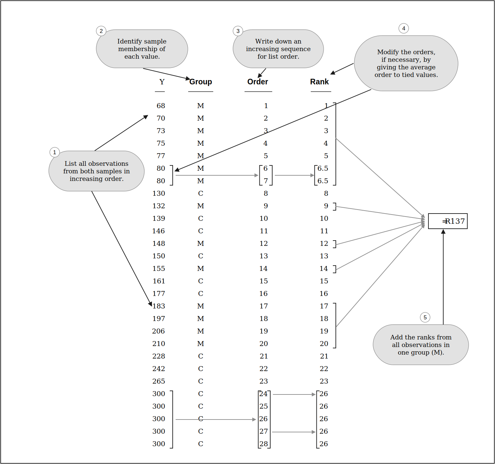

```{r setup}
#| include: false
set.seed(6)
knitr::opts_chunk$set(echo       = TRUE,
                      fig.height = 3,
                      fig.width  = 6,
                      fig.align  = "center")
ggplot2::theme_set(ggplot2::theme_bw())
plt_t <- function(mu = 0, sig = 1, lb = -Inf, ub = Inf, df = Inf, rng = c(-3, 3), two_sided = FALSE, col = "#E69F00", lwd = 1) {
  tibble::tibble(x = seq(mu + rng[[1]] * sig, mu + rng[[2]] * sig, length.out = 500)) |>
    dplyr::mutate(y = dt(x = (x - mu) / sig, df = df)) ->
    df1
  df1 |>
    dplyr::filter(x > lb, x < ub) ->
    df2
  ggplot() +
    geom_line(data = df1, mapping = aes(x = x, y = y), linewidth = lwd) +
    geom_area(data = df2, mapping = aes(x = x, y = y), fill = col) +
    geom_line(data = df2, mapping = aes(x = x, y = y), color = col, linewidth = lwd) +
    theme_classic() +
    theme(axis.title = element_blank()) ->
    pl
  
  if (two_sided) {
    df1 |>
      dplyr::filter(x > -ub, x < -lb) ->
      df3
    pl <- pl + 
      geom_area(data = df3, mapping = aes(x = x, y = y), fill = col) +
      geom_line(data = df3, mapping = aes(x = x, y = y), color = col, linewidth = lwd)
  }
  pl
}
```

```{r}
#| label: load-packages
#| message: false
library(tidyverse)
library(broom)
```

# Learning Objectives

- Recognize which non-parameteric method to use in one- and two-sample scenarios.
- Understand the mechanims of these non-parameteric methods.
- Implement these non-parameteric methods in R.

# Assumptions of $t$-Tools

- Assumptions in decreasing order of importance:
  1. Independence between observational units.
  2. Equal variance (if assuming $\sigma_1^2 = \sigma_2^2$).
  3. Normality (no severe skew or outliers).

- Solutions when violated:
1. Independence: Use multiple linear regression for cluster effects, or use serial correlation adjustment methods (Chapter 15).
  2. Equal variance: Use Welch's $t$-test (which I think you should always use anyway).
  3. Normality: This chapter.
     - Use a Wilcoxon rank sum test for an 2-sample $t$-test alternative.
     - Use a Wilcoxon signed-rank test for a paired $t$-test alternative.
     
# Case Study

- Traditional mathematical graphics have text separate from the graph. Some researchers think this makes learning harder by creating excess "cognitive load".

- They assigned 14 students to learn a new mathematical subject using a traditional graph like this ("conventional") and a different 14 students to learn using a graph that incorporates together text and the graph ("modified").

-   They then had the students complete math problems using the techniques they learned from the graphics. They measured how long it took each student to complete them.

    ```{r}
    #| message: false
    graph <- read_csv("https://dcgerard.github.io/stat_302/data/case0402.csv")
    glimpse(graph)
    ```
-   These data are highly skewed and non-normal
    ```{r}
    ggplot(graph, aes(x = Treatment, y = Time)) +
      geom_boxplot() +
      geom_jitter(width = 0.1)
    ```

- A more worrying issue is that there are 5 students in the conventional group that did not finish the math problems in the allotted time. 

- Their values are listed as "300", but all we know is that their true values are greater than 300 seconds. 

- We call such values "censored".

- $t$-methods do not work well with very skewed data, and they cannot work at all with censored data. We need a new approach.

# The Wilcoxon rank-sum test

## Main Idea

- Also called the Mann-Whitney $U$-test.

- Non-parameteric alternative to the two-sample $t$-test
  - Use when normality is violated
  - Can use on Ordinal Data
  - Can use with censored data, when the censored values can all be designated as "last place" (as in the learning case study).
  
- **Ordinal Data**: Data where the order is known, but numeric values don't have any inherent meaning.
  - Likert Scale: `Strongly Disagree` < `Disagree` < `Neutral` < `Agree` < `Strongly Agree`
  - Visual Acuity: `20/20` > `20/25` > `20/30` ...

- In numeric data that is approximately normal, the rank-sum test works almost as well as the two-sample $t$-test.

- In data with extreme outliers, it works much better than the two-sample $t$-test.


- **Main Idea**: Transform the data into **ranks**
  - Smallest value has a rank of 1
  - Second smallest value has a rank of 2
  - ...
  
- Ranks remove dependence on any distribution.

- Hypotheses:
  - More complicated since the model isn't metric.
  - Let $X$ be a randomly sampled individual from population 1. Let $Y$ be a randomly sampled individual from population 2.
  - $H_0: P(X > Y) = P(X < Y)$
    - Neither population has larger values on average.
  - $H_A: P(X > Y) \neq P(X < Y)$
    - One population is more likely to have larger values.
    
- Procedure:
  1. Rank all observations together
     - Combine both groups then do ranking.
     - Ties are given an average rank.
  2. Sum all of the ranks in one of the groups.
     - Does not matter which one.
     - Conventionally, smaller group is summed.
     - Call the rank-sum-statistic $R$
  3. Compare $R$ to its null distribution to get a $p$-value.
  
- For large $n$ (say, each group has a sample size of at least 5 and there aren't too many ties), $R \sim N(\mu_R, \sigma_R^2)$ **if $H_0$ is true**.
  - $\mu_R$ and $\sigma_R^2$ are some known values that depend just on the number of observations $n$
    
  - Thus, if $H_0$ is true, $Z = (R - \mu_R) / \sigma_r \sim N(0, 1)$
  
  - Calculate the tail area probability of $Z$.
  
    ```{r}
    #| echo: false
    plt_t(mu = 0, sig = 1, lb = 2, two_sided = TRUE) +
      geom_vline(xintercept = 2, lty = 2) +
      scale_x_continuous(breaks = c(-2, 0, 2), labels = c("-Z", "0", "Z"))
    ```
    
    ```r
    2 * pnorm(-abs(z))
    ```
  
::: {.callout-warning}
# Unneccesary detail
Let `rankvec` be the vector of ranks (of length `n1 + n2`), `n1` be the sample size of the first group, and `n2` be the sample size of the second group. Then $\mu_R$ is
```r
mean(rankvec) * n1
```
and $\sigma_R^2$ is
```r
var(rankvec) * n1 * n2 / (n1 + n2)
```
:::

- Here is the process as represented in the book for the graphical data case study

{fig-alt="Graphical display of calculation for rank-sum statistic"}\ 

::: {.panel-tabset}
# Exercise
A professor teaches two small sections. One is an advanced upper-undergraduate course with 5 students and the other is a freshman introductory course with 8 students. Here are his student evaluations of teaching for "Would you recommend this professor" question:

  - Advanced: 5, 5, 4, 4, 2
  - Introductory: 5, 5, 4, 4, 3, 3, 2, 1
  
  Calculate the rank-sum statistic using these data

# Solution

| Value | Group | Order | Rank |
|-------|-------|-------|------|
| 1 | I | 1  | 1    |
| 2 | I | 2  | 2.5  |
| 2 | A | 3  | 2.5  |
| 3 | I | 4  | 4.5  |
| 3 | I | 5  | 4.5  |
| 4 | I | 6  | 7.5  |
| 4 | I | 7  | 7.5  |
| 4 | A | 8  | 7.5  |
| 4 | A | 9  | 7.5  |
| 5 | I | 10 | 11.5 |
| 5 | I | 11 | 11.5 |
| 5 | A | 12 | 11.5 |
| 5 | A | 13 | 11.5 |

Adding up the advanced student ranks, we get

```{r}
2.5 + 7.5 + 7.5 + 11.5 + 11.5
```
:::

::: {.panel-tabset}
# Exercise
You can calculate that the null mean of the ranks is
```{r}
#| echo: false
rvec <- c(1, 2.5, 2.5, 4.5, 4.5, 7.5, 7.5, 7.5, 7.5, 11.5, 11.5, 11.5, 11.5)
mean(rvec) * 5
```

and the null variance of the ranks is
```{r}
#| echo: false
var(rvec) * 5 * 8 / (5 + 8)
```

What is the $p$-value for the Wilcoxon rank-sum test?

# Solution
We calculate the $Z$-statistic
$$
Z = \frac{40.5 - 35}{\sqrt{43.84}} = 0.83
$$
We compare this to a standard normal distribution.
```{r}
2 * pnorm(-0.83)
```
:::

## Rank-sum Test in R

- You can use `wilcox.test()` to run a Wilcoxon rank-sum test in R.
  - It uses the exact same syntax as the two-sample $t$-test
  - Have the response variable to the left of the tilde, have the grouping variable to the right of the tilde, tell R what data frame has the variables.

-   Let's use it on the graphical data.  
    ```{r}
    wilcox.test(Time ~ Treatment, data = graph, exact = FALSE) |>
      tidy()
    ```

::: {.panel-tabset}
# Exercise
You can load in the student evaluation data with
```{r}
set <- tribble(
  ~Class, ~Score,
  "A", 2,
  "A", 4,
  "A", 4,
  "A", 5,
  "A", 5,
  "I", 1,
  "I", 2,
  "I", 3,
  "I", 3,
  "I", 4,
  "I", 4,
  "I", 5,
  "I", 5
)
```
Use `wilcox.test()` to get the $p$-value for the two-sample Wilcoxon rank-sum test.

# Solution
```{r}
wilcox.test(Score ~ Class, data = set, exact = FALSE) |>
  tidy()
```

Some comments:

1.  The rank-sum statistic is different than the one we calculated because they subtract the minimum rank-sum statistic value `sum(1:5)` (the minimum possible, if all advanced students scored below all introductory students).
    ```{r}
    40.5 - sum(1:5)
    ```

2. The $p$-values differ from our approach because 
   a. It uses a continuity correction (adding/subtracting half a rank to better approximate a discrete distribution with a continuous one).
   b. It uses [fancy math](https://en.wikipedia.org/wiki/Edgeworth_series) to improve the asymptotic approximation.
:::

## Exact Approach

- If $n$ is small, or there are very many ties, then an exact approach is possible by using the randomization distribution as the null distribution.
  - Just like in Chapter 2.
  
- Procedure:
  1. Randomize group (treatment) labels
  2. Calculate $R$
  3. Repeat steps 1 and 2 many many times.
  4. Calculate the proportion of simulated $R$'s that are as extreme or more extreme than what we saw.

-   Here is one iteration of generating the randomization distribution  
    ```{r}
    graph |>
      mutate(shuffled_treatment = sample(Treatment)) ->
      graph
    glimpse(graph)
    sum(rank(graph$Time)[graph$shuffled_treatment == "Modified"])
    ```

-   We can do this many times to get this randomization distribution
    ```{r}
    #| echo: false
    niter <- 5000
    rvec <- rep(NA, length.out = niter)
    for (i in seq_len(niter)) {
      graph |>
          mutate(shuffled_treatment = sample(Treatment)) ->
          graph
        rvec[[i]] <- sum(rank(graph$Time)[graph$shuffled_treatment == "Modified"])
    }
    tibble(r = rvec) |>
      ggplot(aes(x = r)) +
      geom_histogram(bins = 30) +
      geom_vline(xintercept = 137, lty = 2, col = "red")
    ```

-   The default in R is to use an exact approach for small sample sizes, but you can always force it to be exact.
    ```{r}
    wilcox.test(Time ~ Treatment, data = graph, exact = TRUE) |>
      tidy()
    ```

- The conclusions don't change for the exact or normal approach in this case.

- We conclude that we have convincing evidence that students typically finish math problems faster when given the modified graphics ($p$ = 0.0016).

## Confidence Intervals

- Under a stricter assumption of additivity, the test becomes more interpretable

-   Let the CDF of $X$ be $F_X()$ and the CDF of $Y$ be $F_Y()$

    ::: {.panel-tabset}
    # Exercise
    In words, what does $F_X(2)$ mean?
    
    # Solution
    This tests if you remember what a CDF is. $F_X(2)$ is the probability that $X$ is less than or equal to 2.
    :::

- If you assume $F_X(a) = F_Y(a + \delta)$ for all $a$ and some fixed $\delta$, then $\delta$ is the additive effect.
  - This assumes that the **shape** of the distributions of $X$ and $Y$ are the same.
  - It assumes that the **only** difference between the two is that one is shifted over.
  - This is a strong assumption.
  
-   Under the additivity assumption, the Wilcoxon rank-sum test is evaluating
    - $H_0: \delta = 0$
    - $H_A: \delta \neq 0$
  
    ```{r}
    #| echo: false
    #| fig-alt: "Faceted density plots, where two groups have same density."
    tibble(x = seq(0, 15, length.out = 200)) |>
      mutate(y = dchisq(x = x, df = 3),
             x1 = x / 3,
             x2 = x1 + 2) |>
      select(y, x1, x2) ->
      df
    
    df |>
      mutate(x2 = x1) |>
      pivot_longer(cols = c("x1", "x2")) |>
      mutate(Group = if_else(name == "x1", "Group 1", "Group 2")) |>
      ggplot(aes(x = value, y = y, color = Group)) +
      geom_line(linewidth = 1) +
      xlab("Variable") +
      ylab("Density") +
      ggtitle(expression(H[0])) +
      facet_grid(.~Group) +
      guides(color = "none") +
      scale_color_manual(values = palette.colors(2)) +
      xlim(0, 7)
    ```
    
    ```{r}
    #| echo: false
    #| fig-alt: "Faceted density plots where one group is shifted."
    df |>
      pivot_longer(cols = c("x1", "x2")) |>
      mutate(Group = if_else(name == "x1", "Group 1", "Group 2")) |>
      ggplot(aes(x = value, y = y, color = Group)) +
      geom_line(linewidth = 1) +
      xlab("Variable") +
      ylab("Density") +
      ggtitle(expression(H[A])) +
      facet_grid(.~Group) +
      guides(color = "none") +
      scale_color_manual(values = palette.colors(2))
    ```

- Under this assumption, we can come up with a confidence interval for $\delta$
  - Run the rank-sum test using $X$ and **shifted** data $Y - \delta_0$ for some $\delta_0$
  - If the $p$-value is greater than 0.05, then $\delta_0$ is in the confidence interval.
  - If the $p$-value is less than 0.05, then $\delta_0$ is not in the confidence interval.
  - Find all $\delta_0$'s that have a $p$-value greater than 0.05 (so we would not reject the null that $\delta = \delta_0$).
  
-   R can do this automatically.

    ```{r}
    wilcox.test(Time ~ Treatment, data = graph, exact = TRUE, conf.int = TRUE) |>
      tidy()
    ```

- So the effect size is estimated to be between 59 seconds and 158 seconds (with 95% confidence)

# The Wilcoxon signed-rank test
