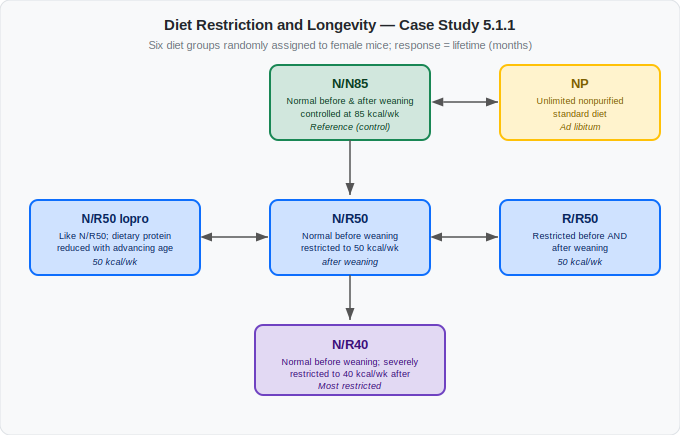
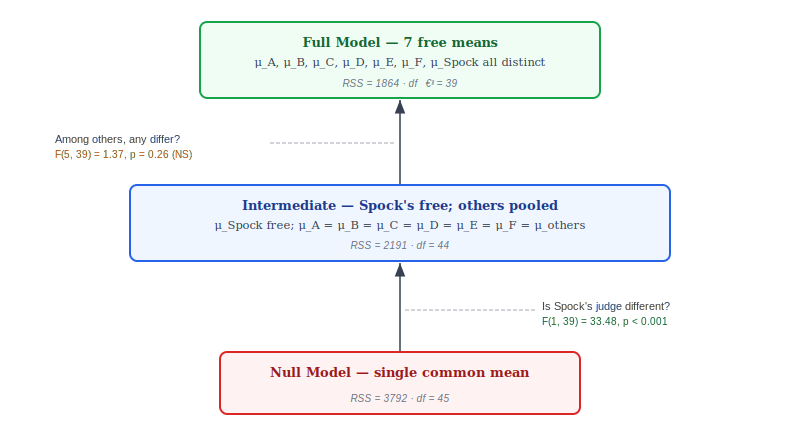

```{r}
#| label: setup
#| include: false
set.seed(7)
library(broom)
library(patchwork)
knitr::opts_chunk$set(echo       = TRUE,
                      fig.height = 3,
                      fig.width  = 5,
                      fig.align  = "center")
ggplot2::theme_set(ggplot2::theme_bw())
```

```{r}
#| label: load-packages
#| message: false
library(tidyverse)
library(gt)
```

# Learning Objectives

- Chapter 5
- Explain the one-way ANOVA model for observational studies and randomized
  experiments.
- State and interpret nested hypotheses.
- Compute and interpret the pooled variance estimate $s_p^2$.
- Conduct pairwise $t$-tests using the pooled variance.
- Set up and interpret the ANOVA $F$-test using the extra-sum-of-squares
  framework.
- Read a nested ANOVA table produced by R.
- Check ANOVA assumptions with residual plots.
- Describe the random-effects model and the intraclass correlation.

---

# Case Studies

```{r}
#| label: load-data
#| message: false
case0501 <- read_csv("https://dcgerard.github.io/stat_302/data/case0501.csv") |>
  mutate(Diet = factor(Diet, levels = c("NP", "N/N85", "N/R50", "R/R50", "lopro", "N/R40")))
case0502 <- read_csv("https://dcgerard.github.io/stat_302/data/case0502.csv") |>
  mutate(Judge = factor(Judge, levels = c("Spock's", "A", "B", "C", "D", "E", "F")))
```

## Case Study 5.1.1: Diet Restriction and Longevity

- Restricting caloric intake can dramatically increase life expectancy in
  animals.
- Randomized experiment: female mice assigned at random to one of six diet
  groups.

| Label | Diet |
|:------|:-----|
| **NP** | Unlimited nonpurified standard diet |
| **N/N85** | Normal diet before and after weaning; controlled at 85 kcal/wk after (serves as the control) |
| **N/R50** | Normal before weaning; restricted to 50 kcal/wk after |
| **R/R50** | Restricted to 50 kcal/wk both before and after weaning |
| **N/R50 lopro** | Like N/R50, but dietary protein decreased with advancing age |
| **N/R40** | Normal before weaning; severely restricted to 40 kcal/wk after |

The response is **lifetime in months**. We are interested in:

1. Are *any* of the diets different from each other in terms of longevity?
2. Do controls (N/N85) live longer than those on nonpurified diets (NP)?
3. Does restricting diets from 85 kcal/wk (N/N85) to 50 kcal/wk (N/R50) increase lifetime?
4. Does Further restriction from 50 kcal/wk (N/R50) to 40 kcal/wk (N/R40) result in even more increase lifetime?
5. Does lowering protein (N/R50 lopro) reduce lifetime compare to those already on a restricted diet (N/R50)?
6. Does restriction both before and after weaning (R/R50) increase lifetime relative to just after weaning (N/R50)?


- Pairwise comparisons of interest:
  
  {fig-align="center" width="85%"}

```{r}
#| label: diet-eda
#| fig-width: 7
case0501 |>
  ggplot(aes(x = Diet, y = Lifetime)) +
  geom_boxplot() +
  labs(y = "Lifetime (months)", x = "Diet group")
```

```{r}
#| label: diet-summary
case0501 |>
  group_by(Diet) |>
  summarise(n       = n(),
            Mean    = mean(Lifetime),
            SD      = sd(Lifetime),
            Median  = median(Lifetime)) |>
  gt() |>
  fmt_number(columns = c(3, 4, 5), decimals = 1)
```

## Case Study 5.1.2: The Spock Conspiracy Trial

- 1968: Dr. Benjamin Spock tried in Boston for encouraging draft resistance
  (Vietnam War).
- Defense argued the trial judge ("Spock's judge") systematically
  underrepresented women on jury venires.
- Compared this judge's venires with six other Boston-area district judges
  (A–F).
- **Observational study**: judge assignment to cases was not randomized.
- Response: `Percent` = percentage of women on each venire.

We are interested in:

1. Is Spock's judge's mean percent-women lower than the other judges?
2. Are the other judges' means all the same?
   - Important to add context that Spock's judge might be illegally removing women from the venire.

```{r}
#| label: spock-eda
#| fig-width: 7
ggplot(case0502, aes(x = Judge, y = Percent)) +
  geom_boxplot() +
  labs(y = "Percent women on venire")
```

---

# The Statistical Model

In each case study we are comparing means across $I$ groups. We observe
$n_i$ individuals in group $i$, for a total of $n = n_1 + n_2 + \cdots + n_I$
observations.

**Notation:**

| Symbol | Meaning |
|:-------|:--------|
| $\mu_i$ | True population mean for group $i$, $i = 1, \ldots, I$ |
| $Y_{ij}$ | Observed value for the $j$th individual in group $i$ |
| $\varepsilon_{ij}$ | Individual-specific noise for the $j$th individual in group $i$: mean 0, variance $\sigma^2$ |

**Model:**
$$Y_{ij} = \mu_i + \varepsilon_{ij}$$

- Each observed value = true group mean + random individual-level noise.
- Noise captures everything unexplained: genetic variation between mice,
  measurement error, day-to-day fluctuation in a judge's venire, etc.
- Key restriction — **equal variance**: $\sigma^2$ is the same for every group
  and every individual.
  - A mouse in the N/R40 group has the same noise variance as a mouse in NP;
    they only differ in expected lifetime.
- This is the $I$-group generalization of the pooled two-sample $t$-test
  (Chapter 2).

**Spock trial interpretation:**

- $\mu_1$ = true mean percent-women for Spock's judge across all possible
  venires
- $\mu_i$ = true mean percent-women for judge $i$, $i = 2, \ldots, 7$
  (judges A–F)
- $Y_{ij}$ = observed percent women on venire $j$ of judge $i$
- $\varepsilon_{ij}$ = random variation in how that particular venire was drawn

**Observational vs. randomized:**
- The model equation $Y_{ij} = \mu_i + \varepsilon_{ij}$ looks the same in both the Spock trial and the longevity study.

- But only in the longevity study can we interpret any causal association (diet and lifetime).

- E.g., if $\mu_{NP}$ is the mean lifetime of mice on the NP diet, and $\mu_{N/N85}$ is the mean lifetime of the mice on the N/N85 diet, then $\delta = \mu_{N/N85} - \mu_{NP}$ is the treatment effect.

- That is, $\delta$ is how much longer, on average, a mouse would live if given the N/N85 diet over the NP diet.

---

# Hypotheses

## Pairwise Hypotheses

Test whether any specific pair of means differs:
$$H_0: \mu_2 = \mu_5, \qquad H_A: \mu_2 \neq \mu_5$$

With $I = 7$ groups there are $\binom{7}{2} = 21$ possible pairwise tests.

## Omnibus Hypothesis ("Are *any* means different?")

$$H_0: \mu_1 = \mu_2 = \mu_3 = \mu_4 = \mu_5 = \mu_6 = \mu_7$$
$$H_A: \text{at least one } \mu_i \neq \mu_j$$

## One Group vs. the Rest

$$H_0: \mu_1 = \tfrac{1}{6}(\mu_2 + \mu_3 + \mu_4 + \mu_5 + \mu_6 + \mu_7)$$
$$H_A: \mu_1 \neq \tfrac{1}{6}(\mu_2 + \mu_3 + \mu_4 + \mu_5 + \mu_6 + \mu_7)$$

This asks: *Is Spock's judge's mean different from the average of the other
judges?*

---

# Estimation

## Group Sample Means

Estimate $\mu_i$ with the group sample mean:
$$\bar{Y}_{i\bullet} = \frac{1}{n_i}\sum_{j=1}^{n_i} Y_{ij}$$

```{r}
#| label: spock-dotplot
#| fig-width: 7
#| echo: false
ggplot(case0502, aes(x = Judge, y = Percent)) +
  geom_jitter(width = 0.15, height = 0) +
  stat_summary(fun = mean, geom = "crossbar",
               color = "tomato", linewidth = 0.5, width = 0.55) +
  labs(y = "Percent women on venire",
       caption = "Red bars = group sample means")
```

## Pooled Variance

- Each group has its own sample SD $s_i$ = spread of observations *within*
  that group.
- Same true variance $\sigma^2$ assumed for every group $\Rightarrow$ combine
  the within-group estimates into one more accurate estimate.
- Weight each group by information contributed — more observations, more weight:

$$s_p^2 = \frac{(n_1-1)s_1^2 + (n_2-1)s_2^2 + \cdots + (n_I-1)s_I^2}
               {(n_1-1) + (n_2-1) + \cdots + (n_I-1)}$$

- Numerator: each $(n_i-1)s_i^2$ = sum of squared deviations from group $i$'s
  mean; summed = total within-group variation.
- Denominator $\nu = n - I$ = total degrees of freedom (lose one df per group
  for estimating each group's mean).
- So $s_p^2$ = average within-group variance.

Two observations:

- Weighted average of the within-group variance estimates, weighted by their
  degrees of freedom.
- When $I = 2$ this reduces exactly to the pooled variance from Chapter 2.

---

# Testing Pairwise Differences

To test $H_0: \mu_i = \mu_j$ vs $H_A: \mu_i \neq \mu_j$, we build a
$t$-statistic in three steps.

**Step 1 — Distribution of the difference under $H_0$.**
Each group mean is approximately normal: $\bar{Y}_{i\bullet} \sim N(\mu_i,\; \sigma^2/n_i)$.
Under $H_0$ ($\mu_i = \mu_j$), the two means are independent, so their
difference is:
$$\bar{Y}_{i\bullet} - \bar{Y}_{j\bullet}
  \;\sim\; N\!\left(0,\; \sigma^2\!\left(\tfrac{1}{n_i} + \tfrac{1}{n_j}\right)\right)$$

**Step 2 — Standardize.** Dividing by the true standard deviation gives a
standard normal:
$$\frac{\bar{Y}_{i\bullet} - \bar{Y}_{j\bullet}}
      {\sigma\sqrt{1/n_i + 1/n_j}} \;\sim\; N(0,1)$$

**Step 3 — Estimate $\sigma$.** We don't know $\sigma$, so we substitute the
pooled estimate $s_p$. Replacing a known standard deviation with an estimate
inflates uncertainty, and the result follows a $t$ distribution:

$$t^* = \frac{\bar{Y}_{i\bullet} - \bar{Y}_{j\bullet}}{s_p\sqrt{1/n_i + 1/n_j}}
       \;\sim\; t_\nu
       \quad \text{under } H_0$$

where $\nu = n - I$.

The advantage over running separate two-sample $t$-tests is that **we use all
the data to estimate $\sigma^2$**, giving more degrees of freedom and a more
accurate variance estimate.

A 95% confidence interval for $\mu_i - \mu_j$ is:

$$\bar{Y}_{i\bullet} - \bar{Y}_{j\bullet}
  \;\pm\; t_{\nu}(0.975) \cdot s_p\sqrt{1/n_i + 1/n_j}$$

::: {.callout-warning}
## Multiple Comparisons

Running 21 pairwise tests at $\alpha = 0.05$ inflates the overall Type I error
rate well above 5%. Chapter 6 covers methods that control for multiple
comparisons. For now, we treat each pairwise test independently and note the
concern.
:::

---

# The ANOVA $F$-Test

For the omnibus hypothesis ($H_0$: all means equal vs $H_A$: at least two differ),
a single summary statistic is needed. The ANOVA $F$-test compares two **nested
models** by asking: *how much does model fit improve when we allow separate group
means?*

## Full and Reduced Models

| | Reduced model ($H_0$) | Full model ($H_A$) |
|:--|:--|:--|
| **Means** | $\mu_1 = \mu_2 = \cdots = \mu_I = \mu$ (one shared mean) | $\mu_1, \mu_2, \ldots, \mu_I$ (separate means) |
| **Estimates** | $\hat{\mu} = \bar{Y}_{\bullet\bullet}$ | $\hat{\mu}_i = \bar{Y}_{i\bullet}$ |
| **# parameters** | 1 | $I$ |

Where
$$
Y_{i\bullet} = \frac{1}{n_i}\sum_{j=1}^{n_i}Y_{ij}
$$
$$
\bar{Y}_{\bullet\bullet} = \frac{1}{n}\sum_{i=1}^I\sum_{j=1}^{n_i}Y_{ij},
$$
$$
n = \sum_{i=1}^{I}n_i
$$

For the Spock data ($I = 7$ judges), here is what each model predicts for
each group:

| Group | Judge | Full model estimates | Reduced model estimates |
|:-----:|:------|:---------------------:|:------------------------:|
| 1 | Spock's | $\bar{Y}_{1\bullet}$ | $\bar{Y}_{\bullet\bullet}$ |
| 2 | Judge A | $\bar{Y}_{2\bullet}$ | $\bar{Y}_{\bullet\bullet}$ |
| 3 | Judge B | $\bar{Y}_{3\bullet}$ | $\bar{Y}_{\bullet\bullet}$ |
| 4 | Judge C | $\bar{Y}_{4\bullet}$ | $\bar{Y}_{\bullet\bullet}$ |
| 5 | Judge D | $\bar{Y}_{5\bullet}$ | $\bar{Y}_{\bullet\bullet}$ |
| 6 | Judge E | $\bar{Y}_{6\bullet}$ | $\bar{Y}_{\bullet\bullet}$ |
| 7 | Judge F | $\bar{Y}_{7\bullet}$ | $\bar{Y}_{\bullet\bullet}$ |

- **Full model**: each group gets its own sample mean as prediction.
  - Spock's venires predicted by Spock's average, Judge A's by Judge A's, etc.
  - 7 free parameters — one per judge.
- **Reduced model**: every observation predicted by the same grand average
  $\bar{Y}_{\bullet\bullet}$ (mean over all 46 venires).
  - This is the $H_0$-is-true model: if all judges have the same expected
    percent-women, the best single prediction is the overall average.
    
```{r}
#| label: null-vs-full.1
#| echo: false
#| fig-width: 9
#| fig-height: 3.2
#| message: false
ybar <- mean(case0502$Percent)

grp_means <- case0502 |>
  group_by(Judge) |>
  summarise(mean_pct = mean(Percent))

rss_null <- sum((case0502$Percent - ybar)^2)
rss_full <- case0502 |>
  left_join(grp_means, by = "Judge") |>
  summarise(rss = sum((Percent - mean_pct)^2)) |>
  pull(rss)

p_null <- ggplot(case0502, aes(x = Judge, y = Percent)) +
  geom_jitter(width = 0.12, height = 0, alpha = 0.7) +
  geom_hline(yintercept = ybar, color = "tomato",
             linetype = "dashed", linewidth = 1) +
  labs(title = "Null model: one overall mean",
       subtitle = paste0("RSS_reduced = ", round(rss_null, 0))) +
  theme(plot.subtitle = element_text(size = 9))

p_full <- ggplot(case0502, aes(x = Judge, y = Percent)) +
  geom_jitter(width = 0.12, height = 0, alpha = 0.7) +
  stat_summary(fun = mean, geom = "crossbar",
               color = "tomato", linewidth = 0.5, width = 0.6) +
  labs(title = "Full model: separate group means",
       subtitle = paste0("RSS_full = ", round(rss_full, 0))) +
  theme(plot.subtitle = element_text(size = 9))

p_null + p_full
```

**What is a residual?** The distance between an observed value and the model's
prediction for it:

- Full model residual: $Y_{ij} - \bar{Y}_{i\bullet}$ 

  - how far observation $(i,j)$ is from *its group's mean*
  
- Reduced model residual: $Y_{ij} - \bar{Y}_{\bullet\bullet}$ 

  - how far observation $(i,j)$ is from *the grand mean*

Intuitively, if the groups really have different means:

- Full model residuals are small — each observation is close to its group mean.
- Reduced model residuals are large — e.g. Spock's observations are far from
  the grand mean.

## Sums of Squared Residuals

The **residual sum of squares** (RSS) for each model is:

$$RSS_{full} = \sum_i \sum_j (Y_{ij} - \bar{Y}_{i\bullet})^2,
\quad df_{full} = n - I$$

$$RSS_{reduced} = \sum_i \sum_j (Y_{ij} - \bar{Y}_{\bullet\bullet})^2,
\quad df_{reduced} = n - 1$$

- Each RSS adds up all the squared residuals across every observation.
  - a small RSS means predictions are close to the data
  - a large RSS means they are far away. 
  - Both RSS values involve squaring (so positive and negative residuals don't cancel) and summing (so we get a single overall measure).

- The **extra sum of squares** (ESS) measures how much the fit improves when we go from the reduced model to the full model:

  $$ESS = RSS_{reduced} - RSS_{full}, \quad df_{extra} = I - 1$$

- **NOTE: $RSS_{reduced} \geq RSS_{full}$** (so $ESS \geq 0$ always)
  - Reduced model is a special case of the full model (set all $\mu_i$ equal).
  - Full model has more flexibility, so it can *never* fit worse — always at
    least as good.

- **What does ESS tell us?**
  - $H_0$ true (means equal): separate group means barely improve fit $\Rightarrow$
    ESS positive but small.
  - Means truly differ: full model fits much better $\Rightarrow$ ESS large.
  - The $F$-test formalizes what "small" and "large" mean.

The plots below illustrate this for the Spock data. Red bars/lines show the
model's fitted means; larger gaps between points and those lines = larger
residuals (blue dashed lines).

```{r}
#| label: null-vs-full.2
#| echo: false
#| fig-width: 9
#| fig-height: 3.2
#| message: false
ybar <- mean(case0502$Percent)

grp_means <- case0502 |>
  group_by(Judge) |>
  summarise(mean_pct = mean(Percent))

rss_null <- sum((case0502$Percent - ybar)^2)
rss_full <- case0502 |>
  left_join(grp_means, by = "Judge") |>
  summarise(rss = sum((Percent - mean_pct)^2)) |>
  pull(rss)

## Pre-compute jittered x-positions so residual segments line up with points
plot_df <- case0502 |>
  left_join(grp_means, by = "Judge") |>
  mutate(xpos = as.integer(Judge) + runif(n(), -0.12, 0.12))

p_null <- ggplot(plot_df, aes(x = xpos, y = Percent)) +
  geom_segment(aes(xend = xpos, yend = ybar),
               color = "blue", linetype = "dashed", linewidth = 0.4) +
  geom_point(alpha = 0.7) +
  geom_hline(yintercept = ybar, color = "tomato",
             linetype = "dashed", linewidth = 1) +
  scale_x_continuous(breaks = 1:nlevels(case0502$Judge),
                     labels = levels(case0502$Judge)) +
  labs(x = "Judge",
       title = "Null model: one overall mean",
       subtitle = paste0("RSS_reduced = ", round(rss_null, 0))) +
  theme(plot.subtitle = element_text(size = 9))

p_full <- ggplot(plot_df, aes(x = xpos, y = Percent)) +
  geom_segment(aes(xend = xpos, yend = mean_pct),
               color = "blue", linetype = "dashed", linewidth = 0.4) +
  geom_point(alpha = 0.7) +
  geom_segment(data = grp_means,
               aes(x = as.integer(Judge) - 0.3, xend = as.integer(Judge) + 0.3,
                   y = mean_pct, yend = mean_pct),
               color = "tomato", linewidth = 0.6, inherit.aes = FALSE) +
  scale_x_continuous(breaks = 1:nlevels(case0502$Judge),
                     labels = levels(case0502$Judge)) +
  labs(x = "Judge",
       title = "Full model: separate group means",
       subtitle = paste0("RSS_full = ", round(rss_full, 0))) +
  theme(plot.subtitle = element_text(size = 9))

p_null + p_full
```

The squared residuals are much smaller under the full model, confirming that
group means differ substantially.

```{r}
#| label: sq-resid-boxplot
#| echo: false
#| fig-height: 3
sq_resid_df <- bind_rows(
  case0502 |>
    left_join(grp_means, by = "Judge") |>
    mutate(sq_resid = (Percent - mean_pct)^2, Model = "Full"),
  case0502 |>
    mutate(sq_resid = (Percent - ybar)^2, Model = "Reduced")
)

ggplot(sq_resid_df, aes(x = Model, y = sq_resid)) +
  geom_boxplot() +
  labs(y = "Squared residual",
       title = "Squared residuals are smaller in the full model")
```

## The $F$-Statistic

- $H_0$ true: both $ESS/df_{extra}$ and $RSS_{full}/df_{full} = s_p^2$ estimate
  the same $\sigma^2$ $\Rightarrow$ ratio near 1.
- $H_A$ true: means differ, $ESS$ inflated $\Rightarrow$ ratio above 1.

$$F = \frac{ESS / df_{extra}}{s_p^2}
    = \frac{ESS / (I-1)}{RSS_{full} / (n-I)}$$

Under $H_0$, $F \sim F_{I-1,\; n-I}$. The $p$-value uses only the upper
tail (large $F$ is evidence against $H_0$).

## The $F$-Distribution

The $F$ distribution is parameterized by two degrees of freedom: numerator
($df_1$) and denominator ($df_2$). Below are a few shapes:

```{r}
#| label: f-dist-shapes
#| echo: false
#| fig-width: 9
#| fig-height: 5
x_seq <- seq(0, 6, length = 300)
f_df <- bind_rows(
  data.frame(x = x_seq, y = df(x_seq, 2,   10),  label = "F(2, 10)"),
  data.frame(x = x_seq, y = df(x_seq, 6,   39),  label = "F(6, 39)"),
  data.frame(x = x_seq, y = df(x_seq, 10, 100),  label = "F(10, 100)")
)

ggplot(f_df, aes(x = x, y = y, color = label)) +
  geom_line(linewidth = 0.9) +
  labs(x = "F", y = "f(F)", color = NULL,
       title = "F-distribution shapes") +
  theme(legend.position = "bottom")
```

## $p$-Value for the Spock Omnibus Test

The Spock data has $I = 7$ judges and $n = 46$ venires, so $df_{extra} = 6$
and $df_{full} = 39$.

```{r}
#| label: spock-ftest-manual
case0502 |>
  mutate(muhat_null = mean(Percent)) |> # null mean
  group_by(Judge) |>
  mutate(muhat_alt = mean(Percent)) |> # alt mean
  ungroup() |>
  mutate( 
    resid_null = Percent - muhat_null, 
    resid_alt = Percent - muhat_alt
  ) |>
  summarize(
    rss_null = sum(resid_null^2),
    rss_alt = sum(resid_alt^2),
    n = n(),
    I = n_distinct(Judge)
  ) |>
  mutate(
    df_null = n - 1,
    df_full = n - I,
    df_extra = df_null - df_full, ## I - 1
    ess = rss_null - rss_full,
    sp2 = rss_full / df_full,
    fstat = (ess / df_extra) / sp2
  ) ->
  df
```

```{r}
#| echo: false
df |>
  gt() |>
  fmt_number(columns = c(1,2,8,9,10), decimals = 2)
```

```{r}
#| label: spock-pvalue
pf(df$fstat, df1 = df$df_extra, df2 = df$df_full, lower.tail = FALSE)
```

```{r}
#| label: spock-f-plot
#| echo: false
#| fig-height: 2.8
x <- seq(0, 8, length = 500)
y <- df(x, df1 = 6, df2 = 39)
poly_x <- c(df$fstat, x[x >= df$fstat], max(x[x >= df$fstat]))
poly_y <- c(0, y[x >= df$fstat], 0)

ggplot(data.frame(x = x, y = y), aes(x, y)) +
  geom_line() +
  geom_polygon(data = data.frame(x = poly_x, y = poly_y),
               aes(x, y), fill = "#E69F00", alpha = 0.6, color = "#E69F00") +
  geom_vline(xintercept = df$fstat, linetype = "dashed") +
  annotate("text", x = df$fstat + 0.35, y = 0.05,
           label = paste0("F* = ", round(df$fstat, 2)), hjust = 0) +
  labs(x = "F", y = "f(F)",
       title = expression(F[list(6, 39)] ~ "null distribution"),
       subtitle = "Shaded area = p-value")
```

---

# A Hierarchy of Models

An F-test can be used to compare any two **nested** models. 

In the Spock example, we had three nested models:

- **$H_1$**: all means equal $(\mu)$
- **$H_2$**: Spock's judge differs from a common mean for the rest
  $(\mu_\text{Spock}, \mu_\text{others})$
- **$H_3$**: all seven means free $(\mu_1, \mu_2, \ldots, \mu_7)$

Here is what each model predicts for each judge in the Spock data.

**$H_1$ vs. $H_2$** — Is Spock's judge different from the rest?

- $H_1: \mu_1 = \cdots = \mu_7$ (all same)
- $H_2: \mu_1 \neq \mu_2 = \cdots = \mu_7$ (Spock is different)

| Group | Judge | $H_1$ (reduced) | $H_2$ (full) |
|:-----:|:------|:--------------:|:-------------------:|
| 1 | Spock's | $\bar{Y}_{\bullet\bullet}$ | $\bar{Y}_{1\bullet}$ |
| 2 | Judge A | $\bar{Y}_{\bullet\bullet}$ | $\bar{Y}_{0}$ |
| 3 | Judge B | $\bar{Y}_{\bullet\bullet}$ | $\bar{Y}_{0}$ |
| 4 | Judge C | $\bar{Y}_{\bullet\bullet}$ | $\bar{Y}_{0}$ |
| 5 | Judge D | $\bar{Y}_{\bullet\bullet}$ | $\bar{Y}_{0}$ |
| 6 | Judge E | $\bar{Y}_{\bullet\bullet}$ | $\bar{Y}_{0}$ |
| 7 | Judge F | $\bar{Y}_{\bullet\bullet}$ | $\bar{Y}_{0}$ |

- $\bar{Y}_{\bullet\bullet}$ = grand mean of all 46 venires.
- $\bar{Y}_{0}$ = average percent-women across all venires of judges A–F
  (groups 2–7).
- $H_2$ has 2 parameters: Spock's judge ($\bar{Y}_{1\bullet}$)
  and one pooled mean for the other six ($\bar{Y}_{0}$).

Plots below: the drop in RSS from $H_1$ to $H_2$ is the ESS for this test.

```{r}
#| label: null-vs-inter
#| echo: false
#| fig-width: 9
#| fig-height: 3.2
spock_mean <- case0502 |>
  filter(Judge == "Spock's") |>
  pull(Percent) |>
  mean()
other_mean <- case0502 |>
  filter(Judge != "Spock's") |>
  pull(Percent) |>
  mean()

rss_inter <- case0502 |>
  mutate(fitted = if_else(Judge == "Spock's", spock_mean, other_mean)) |>
  summarise(rss = sum((Percent - fitted)^2)) |>
  pull(rss)

seg_inter <- data.frame(
  x    = c(0.65, 6.65),
  xend = c(6.35, 7.35),
  y    = c(other_mean, spock_mean),
  yend = c(other_mean, spock_mean)
)

p_null2 <- ggplot(case0502, aes(x = Judge, y = Percent)) +
  geom_jitter(width = 0.12, height = 0, alpha = 0.7) +
  geom_hline(yintercept = ybar, color = "tomato",
             linetype = "dashed", linewidth = 1) +
  labs(title = expression(H[1] * ": one overall mean"),
       subtitle = paste0("RSS = ", round(rss_null, 0))) +
  theme(plot.subtitle = element_text(size = 9))

p_inter <- ggplot(case0502, aes(x = Judge, y = Percent)) +
  geom_jitter(width = 0.12, height = 0, alpha = 0.7) +
  geom_segment(data = seg_inter,
               aes(x = x, xend = xend, y = y, yend = yend),
               color = "tomato", linetype = "dashed", linewidth = 1,
               inherit.aes = FALSE) +
  labs(title = expression(H[2] * ": Spock's judge differs"),
       subtitle = paste0("RSS = ", round(rss_inter, 0))) +
  theme(plot.subtitle = element_text(size = 9))

p_null2 + p_inter
```

**$H_2$ vs. $H_3$** — Do judges A–F differ among themselves?

- $H_2: \mu_1 \neq \mu_2 = \cdots = \mu_7$ (Spock is different)
- $H_3:$ At least one $\mu_i \neq \mu_j$ for $i,j\in \{2,\ldots,7\}$

| Group | Judge | $H_2$ (reduced) | $H_3$ |
|:-----:|:------|:----------------------:|:----:|
| 1 | Spock's | $\bar{Y}_{1\bullet}$ | $\bar{Y}_{1\bullet}$ |
| 2 | Judge A | $\bar{Y}_{0}$ | $\bar{Y}_{2\bullet}$ |
| 3 | Judge B | $\bar{Y}_{0}$ | $\bar{Y}_{3\bullet}$ |
| 4 | Judge C | $\bar{Y}_{0}$ | $\bar{Y}_{4\bullet}$ |
| 5 | Judge D | $\bar{Y}_{0}$ | $\bar{Y}_{5\bullet}$ |
| 6 | Judge E | $\bar{Y}_{0}$ | $\bar{Y}_{6\bullet}$ |
| 7 | Judge F | $\bar{Y}_{0}$ | $\bar{Y}_{7\bullet}$ |

- Asks: after accounting for Spock's judge, do the remaining six judges differ
  from each other?
- Plots below compare $H_2$ (reduced) vs. $H_3$; ESS here captures only
  variation *among* judges A–F.

```{r}
#| label: inter-vs-full
#| echo: false
#| fig-width: 9
#| fig-height: 3.2
p_inter2 <- ggplot(case0502, aes(x = Judge, y = Percent)) +
  geom_jitter(width = 0.12, height = 0, alpha = 0.7) +
  geom_segment(data = seg_inter,
               aes(x = x, xend = xend, y = y, yend = yend),
               color = "tomato", linetype = "dashed", linewidth = 1,
               inherit.aes = FALSE) +
  labs(title = expression(H[2] * ": Spock's judge differs"),
       subtitle = paste0("RSS = ", round(rss_inter, 0))) +
  theme(plot.subtitle = element_text(size = 9))

p_full2 <- ggplot(case0502, aes(x = Judge, y = Percent)) +
  geom_jitter(width = 0.12, height = 0, alpha = 0.7) +
  stat_summary(fun = mean, geom = "crossbar",
               color = "tomato", linewidth = 0.5, width = 0.55) +
  labs(title = expression(H[3] * ": all judges separate"),
       subtitle = paste0("RSS = ", round(rss_full, 0))) +
  theme(plot.subtitle = element_text(size = 9))

p_inter2 + p_full2
```

- Always fit *both* models using *all* the data — never discard Spock's
  observations, even when comparing only judges A–F.
- Matters for the variance estimate:
  - Subset of 39 venires (A–F only): $df = 32$.
  - All 46 venires with $s_p^2$ from the full model: $df = 39$.
- More df $\Rightarrow$ better variance estimate $\Rightarrow$ more powerful test.

{fig-align="center" width="90%"}

The full sequential ANOVA table for the Spock data is:

| Model | $df_{RSS}$ | RSS | $df_{extra}$ | ESS | $F$ | $p$-value |
|:------|:----------:|----:|:------------:|----:|----:|----------:|
| All same | 45 | 3792 | | | | |
| Spock's differs | 44 | 2191 | 1 | 1601 | 33.48 | <0.001 |
| All different | 39 | 1864 | 5 | 326 | 1.37 | 0.26 |

**Conclusions:**

- Strong evidence that Spock's judge has a different (lower) mean than the
  other judges ($F_{1,39} = 33.48$, $p < 0.001$).
- No evidence that the six non-Spock judges differ among themselves
  ($F_{5,39} = 1.37$, $p = 0.26$).

---

# One-Way ANOVA in R

## Checking the Grouping Variable

Before fitting, confirm the grouping variable is a `factor` or `character`:

```{r}
class(case0502$Judge)
```

- If numeric, `aov()` treats it as a continuous predictor, not a grouping
  variable.
- Fix with `as.factor()` or `mutate(Judge = factor(Judge))`.

## Omnibus $F$-Test with `aov()` and `tidy()`

```{r}
#| label: aov-full
aout_h3 <- aov(Percent ~ Judge, data = case0502)
tidy(aout_h3)
```

The table has two rows:

| Row | $df$ | Sum Sq | Mean Sq | $F$ | $p$-value |
|:----|:-----|-------:|--------:|----:|----------:|
| `Judge` | $df_{extra} = I - 1$ | $ESS$ | $ESS / df_{extra}$ | $F$-stat | $p$ |
| `Residuals` | $df_{full} = n - I$ | $RSS_{full}$ | $RSS_{full}/df_{full} = s_p^2$ | | |

## Pairwise Comparisons

```{r}
#| label: pairwise-t
ptout <- pairwise.t.test(x = case0502$Percent,
                         g = case0502$Judge,
                         p.adjust.method = "none")
ptout
```

Each cell is the raw (unadjusted) $p$-value for that pair. Note that
`pairwise.t.test()` uses $s_p^2$ from **all** groups to form the $t$-statistic,
even when comparing just two groups.

## Nested Model Comparisons with `anova()`

To test $H_2$ (Spock's differs; others same) versus $H_1$ (all same):

```{r}
#| label: nested-models
case0502 <- case0502 |>
  mutate(isSpock = Judge == "Spock's")

aout_h2 <- aov(Percent ~ isSpock, data = case0502)
aout_h1 <- aov(Percent ~ 1,       data = case0502)
```

```{r}
#| label: spock-vs-others
anova(aout_h2, aout_h3) |>
  tidy()
```

The rows are:

| Row | $df_{RSS}$ | RSS | $df_{extra}$ | ESS | $F$ | $p$ |
|:----|:----------:|----:|:------------:|----:|----:|----:|
| Model 1 (reduced) | $df_{reduced}$ | $RSS_{reduced}$ | | | | |
| Model 2 (full) | $df_{full}$ | $RSS_{full}$ | $df_{extra}$ | ESS | $F$-stat | $p$ |

## Full Sequential ANOVA Table

Compare all three models at once:

```{r}
#| label: three-model-anova
anova(aout_h1, aout_h2, aout_h3) |>
  tidy()
```

This produces the sequential table shown in the hierarchy section above. Row 2
tests $H_1$ vs $H_2$; Row 3 tests $H_2$ vs $H_3$.


::: {.callout-warning}
# Unnecessary Detail
Note that in R, it is customary to use the fullest model's estimate of $\sigma^2$ in the denominator for **all** $F$-statistics in an ANOVA table. Thus, we get slightly different results for
```{r}
anova(aout_h1, aout_h2)$F[[2]]
anova(aout_h1, aout_h2, aout_h3)$F[[2]]
```

- Both $F$-statistics evaluate $H_1$ versus $H_2$
- The first estimates $\sigma^2$ from the $H_2$ fit.
- The second estimates $\sigma^2$ from the $H_3$ fit.
- The idea is that the least biased (though, not necessarily the best) estimate of $\sigma^2$ comes from the most complicated model.
- In practice, I don't think this matters that much. But it is something to be aware of.
:::

---

# Assumptions and Diagnostics

The same three assumptions from the two-sample $t$-test apply, in the same
order of importance:

1. **Independence** of observations.
2. **Equal variance** across all groups.
3. **Normality** (approximately symmetric, no severe outliers).

**New tool for checking assumptions 2 and 3: residual plots.**

The **residual** for observation $(i,j)$ under the full model is:
$$e_{ij} = Y_{ij} - \bar{Y}_{i\bullet}$$

Plotting residuals removes the group-mean structure, letting us focus on the *variation about the mean* without visual clutter from the differences in means between groups.

::: {.callout-important}
# Which Model to Evaluate?
Evaluate a rich model. 

In the Spock case, the one where each judge has its own mean.

In the longevity case, the one where each diet has its own mean.

The reduced models might be wrong. This would violate the indepdendence assumption, since residuals within groups would be correlated due to the group structure.
:::

## Residual Plots in R

The quickest way is `plot()` applied to an `aov()` object:

```{r}
#| label: base-resid-plots
#| fig-width: 7
#| fig-height: 6
par(mfrow = c(2, 2))
plot(aout_h3)
par(mfrow = c(1, 1))
```

The two most important panels:

- **Residuals vs. Fitted**: residuals ($y$-axis) vs. group means ($x$-axis).
  Look for unequal spread across the fitted values.
- **Normal Q-Q**: QQ-plot of residuals. Look for departures from a straight
  line (skew, heavy tails, outliers).

## Manual `ggplot2` Residual Plots

- Use `augment()` to get the fitted values and the residuals.

- You can then use ggplot2 code as you like.

```{r}
#| label: ggplot-resids
#| warning: false
aug_full <- augment(aout_h3)

p_rv_fit <- ggplot(aug_full, aes(x = .fitted, y = .resid)) +
  geom_point() +
  geom_hline(yintercept = 0, linetype = "dashed") +
  labs(x = "Fitted values (group means)",
       y = "Residuals",
       title = "Residuals vs. fitted")

p_rv_grp <- ggplot(aug_full, aes(x = Judge, y = .resid)) +
  geom_boxplot() +
  geom_hline(yintercept = 0, linetype = "dashed") +
  labs(y = "Residuals", title = "Residuals by group")

p_rv_fit + p_rv_grp
```

```{r}
#| label: qq-resid
ggplot(aug_full, aes(sample = .resid)) +
  geom_qq() +
  geom_qq_line() +
  labs(title = "Normal Q-Q plot of residuals")
```

## What to Look For

**Unequal variance** appears as fan-shaped spread in the Residuals vs.
Fitted plot — larger spread for larger fitted values (or vice versa):

```{r}
#| label: bad-unequal-var
#| echo: false
set.seed(2)
resid_bad_var <- rnorm(n = nrow(case0502),
                       mean = 0,
                       sd   = aug_full$.fitted^3 / 3e6)
tibble(resid = resid_bad_var, fitted = aug_full$.fitted) |>
  ggplot(aes(x = fitted, y = resid)) +
  geom_point() +
  geom_hline(yintercept = 0, linetype = "dashed") +
  labs(x = "Fitted values", y = "Residuals",
       title = "Simulated unequal variance (fan shape)")
```

**An outlier** appears as an isolated point far from 0:

```{r}
#| label: bad-outlier
#| echo: false
resid_out <- aug_full$.resid
resid_out[1] <- 35
tibble(resid = resid_out, fitted = aug_full$.fitted) |>
  ggplot(aes(x = fitted, y = resid)) +
  geom_point() +
  geom_hline(yintercept = 0, linetype = "dashed") +
  labs(x = "Fitted values", y = "Residuals",
       title = "Simulated outlier")
```

**Solutions** mirror Chapter 3:

| Violation | Solution |
|:----------|:---------|
| Independence | ANOVA with blocking (Chapters 12–13) |
| Unequal variance | Welch-style ANOVA; log transformation |
| Non-normality / outliers | Transformation; run with and without outlier; Kruskal-Wallis |

---

# Random Effects

- **Fixed effects** (so far): the groups (judges, diets) are the specific
  groups of interest — we compare these particular groups.
- **Random effects**: groups are *not* of direct interest.
  - They are a random sample from a larger population of groups.
  - Goal: infer **variability among groups** in that population.
- **Example** — quality control: output of 7 randomly selected machines.
  - Don't care about those 7 specific machines.
  - Want machine-to-machine variability across the whole factory floor.
- When groups are a random sample from a larger population, use the
  **random-effects model**.

## The Random-Effects Model

The model is written in two layers:

$$Y_{ij} = \mu_i + \varepsilon_{ij},
\quad \text{var}(\varepsilon_{ij}) = \sigma^2$$
$$\mu_i = \mu + \xi_i,
\quad \text{var}(\xi_i) = \sigma_p^2$$

- Line 1: identical to the fixed-effects model.
- Line 2: each group mean $\mu_i$ is itself **random** — overall average $\mu$
  plus a random group-specific deviation $\xi_i$ (mean 0, variance $\sigma_p^2$).

Every observation has two sources of randomness:

1. **Within-group noise** $\varepsilon_{ij}$: how much individual $j$ in
   group $i$ differs from its group's mean (variance $\sigma^2$).
2. **Between-group noise** $\xi_i$: how much group $i$'s mean differs from
   the overall mean $\mu$ (variance $\sigma_p^2$).

If $\sigma_p^2 = 0$, all groups have the same true mean ($\mu_i = \mu$ for
all $i$), and there is no between-group variability at all.

**Hypotheses:**
$$H_0: \sigma_p^2 = 0 \quad \text{(no between-group variability — all group means equal } \mu\text{)}$$
$$H_A: \sigma_p^2 > 0 \quad \text{(some groups have higher/lower means than others)}$$

We run the **same $F$-test as before**. Under $H_0$, the $F$-statistic has
the same $F_{I-1,\, n-I}$ null distribution.

## Why Use This Model?

- In one-way ANOVA, the $F$-test $p$-value is identical for fixed or random
  groups. So why bother?
- In more complex models — multiple random factors, or the same individuals
  in multiple groups — treating groups as random gives different (generally
  better) estimates and inference.
- The one-way case is the simplest introduction to this framework.

## Intraclass Correlation (ICC)

The ICC measures the **proportion of total variance explained by group
membership**:

$$\text{ICC} = \frac{\hat\sigma_p^2}{\hat\sigma_p^2 + \hat\sigma^2}$$

- Total variance of any $Y_{ij}$ = $\sigma_p^2 + \sigma^2$ (between-group +
  within-group).
- ICC = fraction of that total coming from between-group differences.

- **ICC close to 1**: most variation is *between* groups — knowing the group
  an observation belongs to tells you most of what you need to know about its
  value.
- **ICC close to 0**: most variation is *within* groups — group membership
  explains very little; individual-level noise dominates.

---

# Exercises

**1.** The diet study (Case Study 5.1.1) is a randomized experiment, while
the Spock trial (Case Study 5.1.2) is an observational study.

  a. For each study, identify the explanatory variable and the response
     variable.
  b. For each study, state whether a causal conclusion is justified if the
     $F$-test is significant. Explain.

**2.** Using the diet data (`case0501`):

  a. Fit the one-way ANOVA model with `aov()` and display the ANOVA table.
  b. State the null and alternative hypotheses for the omnibus $F$-test.
  c. Report the $F$-statistic, degrees of freedom, and $p$-value. What do
     you conclude?

```{r}

```

**3.** From the ANOVA table in Exercise 2, identify (by number, not name):

  a. $RSS_{full}$ and $df_{full}$.
  b. $s_p^2$ (the pooled variance estimate).
  c. $ESS$ and $df_{extra}$.
  d. The $F$-statistic — verify it equals $ESS/df_{extra}$ divided by $s_p^2$.

**4.** For the Spock data, use `pairwise.t.test()` to obtain all pairwise
$p$-values (unadjusted).

  a. How many pairwise comparisons are there?
  b. Which pairs, if any, show evidence of a difference at $\alpha = 0.05$?
  c. Why is it potentially problematic to use $\alpha = 0.05$ for each test
     individually when conducting this many comparisons?

```{r}

```

**5.** Fit the three nested models for the Spock data ($H_1$, $H_2$, $H_3$)
and reproduce the sequential ANOVA table using `anova()`.

  a. What is Spock's judge's estimated percent-women on the venire?
  b. What is the pooled estimate for the other six judges?
  c. Interpret the two $F$-tests in the sequential table. What overall
     conclusion do you draw about the Spock trial jury selection?

```{r}

```

**6.** For the diet study, test whether the two most calorie-restricted groups
(N/R40 and R/R50) differ in mean lifetime from the control group (N/N85).

  a. Create a new binary variable that indicates whether the mouse is in one
     of those two groups vs. the control group.
  b. Fit the appropriate reduced model and use `anova()` to test the
     hypothesis.
  c. Interpret the result.

```{r}

```

**7.** For the Spock data, make the three residual plots:

  a. Residuals vs. fitted values.
  b. Residuals vs. judge (boxplots).
  c. QQ-plot of residuals.

Comment on whether the equal-variance and normality assumptions appear
reasonable.

```{r}

```

**8.** Explain in your own words why the pooled variance estimate $s_p^2$
uses **all** groups (not just the two being compared) when conducting a
pairwise $t$-test in the one-way ANOVA framework. What is the practical
benefit of this approach?

**9.** For the Spock data, the omnibus $F$-test gives a very small $p$-value.

  a. Does a significant omnibus $F$-test tell you *which* pairs of means differ?
     Explain.
  b. After seeing a significant omnibus result, a student decides to examine
     only the comparison that looks most different in the boxplot and ignores
     the others. What is the statistical problem with this strategy?

**10.** Consider a one-way ANOVA with $I = 4$ groups and $n = 40$ total
observations.

  a. What are $df_{extra}$ and $df_{full}$?
  b. If $RSS_{full} = 720$ and $ESS = 180$, compute $s_p^2$, the $F$-statistic,
     and the $p$-value.
  c. What is the $p$-value from `pf()` in R?

```{r}

```

**11.** Describe the difference between a **fixed-effects** and a
**random-effects** one-way ANOVA model. For each scenario below, state which
model is more appropriate and why.

  a. Comparing mean test scores across 5 specific schools that were chosen
     because they use different curricula.
  b. Comparing output quality across 6 machines randomly selected from a
     factory floor, to estimate how much machine-to-machine variability exists.
  c. Comparing soil nitrogen levels across 8 randomly chosen plots in a large
     field.

**12.** A researcher fits a one-way ANOVA with $I = 5$ groups and finds
$RSS_{full} = 400$ (df = 45), $RSS_{reduced} = 520$ (df = 49).

  a. Compute $ESS$ and $df_{extra}$.
  b. Compute $s_p^2$ and the $F$-statistic.
  c. Compute the $p$-value. Is there evidence of group differences?
  d. Compute the ICC estimate, given that the estimated between-group variance
     is $\hat\sigma_p^2 = 6.0$.
