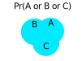
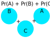

```{r}
#| label: setup
#| include: false
set.seed(9)
library(car)
knitr::opts_chunk$set(echo       = TRUE,
                      fig.height = 3,
                      fig.width  = 5,
                      fig.align  = "center")
ggplot2::theme_set(ggplot2::theme_bw())
```

```{r}
#| label: load-packages
#| message: false
library(tidyverse)
```

```{r}
#| label: load-data
#| message: false
#| include: false
case0502 <- read_csv("https://dcgerard.github.io/stat_302/data/case0502.csv") |>
  mutate(Judge = factor(Judge))
case0601 <- read_csv("https://dcgerard.github.io/stat_302/data/case0601.csv")
```

# Learning Objectives

- Explain why running many hypothesis tests inflates the Type I error rate.
- Distinguish between planned comparisons and data snooping.
- Define the family-wise error rate (FWER) and adjusted $p$-values.
- Apply the Bonferroni, Holm, and Tukey-Kramer corrections in R.
- Construct adjusted confidence intervals using the appropriate multiplier.

---

# The Multiple Testing Problem

## $p$-Values and False Positives

- $p$-value = probability of data as extreme as observed **if $H_0$ were true**.
- Single test at $\alpha = 0.05$ with $H_0$ true $\Rightarrow$ 5% chance of a false positive.
- Run $m$ tests (all $H_0$ true), reject each at $\alpha$ $\Rightarrow$ expect $0.05m$ false rejections.
- $m = 21$ pairwise tests $\Rightarrow$ ~1 spurious rejection on average, even when all means equal.

## Simulation Illustration

```{r}
#| label: sim-illustration
set.seed(7)
tvec   <- rt(1000, df = 20)
pvalue <- 2 * pt(-abs(tvec), df = 20)
mean(pvalue < 0.05)
```

- All 1,000 tests simulated under $H_0$.
- Still ~5% of $p$-values fall below 0.05.


## Data Snooping

- Five-group dataset below — all means are **truly equal**.

```{r}
#| label: snoop-data
#| echo: false
#| fig-width: 5
set.seed(7)
df_snoop <- data.frame(x = factor(rep(1:5, each = 5)),
                       y = rnorm(25))
ggplot(df_snoop, aes(x = x, y = y)) +
  geom_boxplot() +
  labs(x = "Group", y = "Response",
       title = "Five groups — all means truly equal")
```

- Groups 1 and 3 look most different in the plot.
- Test only that pair *after* peeking $\Rightarrow$ misleadingly small $p$-value.
- Problem: we picked the pair *because* it looked extreme.

```{r}
#| label: snoop-pvals
pairwise.t.test(df_snoop$y, df_snoop$x, p.adjust.method = "none")
```

- **Data snooping**: choosing which hypotheses to test *after* seeing the data.
    - Inflates Type I error rate beyond $\alpha$.
- **Planned comparison**: hypothesis chosen *before* seeing the data.
    - Based on scientific reasoning, not on what the data suggest.

---

# Case Study: Physical Handicaps and Perceived Qualifications

- **Question:** do physical handicaps affect perceived job qualifications?
- **Design:** five videotaped interviews, same actor, different apparent handicap in each.
- 70 undergraduates randomly assigned to view one tape.
- Rated the applicant's qualifications on a 0–10 scale.

```{r}
#| label: handicap-load
#| message: false
case0601 <- read_csv("https://dcgerard.github.io/stat_302/data/case0601.csv")
```

```{r}
#| label: handicap-eda
#| fig-width: 7
ggplot(case0601, aes(x = Handicap, y = Score)) +
  geom_boxplot() +
  labs(y = "Qualification score (0–10)")
```

All $\binom{5}{2} = 10$ pairwise tests, **no adjustment**:

```{r}
#| label: handicap-unadj
pairwise.t.test(x = case0601$Score,
                g = case0601$Handicap,
                p.adjust.method = "none")
```

- A handful of $p$-values are below 0.05.
- But we ran 10 tests at once: even under all-true nulls, expect $10 \times 0.05 = 0.5$ false rejections.
- **Question:** genuine signal, or lucky noise?

---

# Family-Wise Error Rate

- **Family-wise error rate (FWER):** probability of *at least one* Type I error across the family of tests.
- **Adjusted $p$-value:** defined so that

> Rejecting when the adjusted $p$-value $< \alpha$ guarantees that the FWER
> is at most $\alpha$.

---

# Correction Procedures

## Bonferroni

- **Procedure:** multiply each raw $p$-value by $m$ (total number of tests).
- **Conditions:** any family of pre-planned tests; need not be pairwise.

**Proof that FWER $\leq \alpha$:**

- Let $m_0$ = number of tests with $H_0$ true; $p_i$ = raw $p$-value for test $i$.

$$\text{FWER} = Pr(mp_1 \leq \alpha \text{ or } \cdots \text{ or } mp_{m_0} \leq \alpha)$$

- Key tool — the **Bonferroni (union) bound**: for any events $A_1, \ldots, A_k$,

$$Pr(A_1 \cup A_2 \cup \cdots \cup A_k) \leq Pr(A_1) + Pr(A_2) + \cdots + Pr(A_k)$$

- Illustrated below for three events:

::: {layout-ncol=2}



:::

- Applying the bound:

$$\text{FWER} \leq Pr(mp_1 \leq \alpha) + \cdots + Pr(mp_{m_0} \leq \alpha)
= \frac{\alpha}{m} + \cdots + \frac{\alpha}{m}
= \frac{m_0 \alpha}{m}
\leq \frac{m\alpha}{m} = \alpha$$

## Holm

- **Procedure:** order raw $p$-values $p_{(1)} \leq p_{(2)} \leq \cdots \leq p_{(m)}$.
    - $k$th smallest adjusted to $\min\bigl((m - k + 1) \cdot p_{(k)},\; 1\bigr)$.
    - Applied sequentially so adjusted values are non-decreasing.
- **Conditions:** same as Bonferroni — any pre-planned tests.
- **Advantage:** uniformly more powerful than Bonferroni (rejects at least as often), still controls FWER at $\alpha$.

## Tukey-Kramer

- **Procedure:** uses the *studentized range distribution* for exact $p$-values and CIs across all $\binom{I}{2}$ pairwise comparisons at once.
- **Conditions:** only valid for **all pairwise comparisons** in a one-way ANOVA (balanced or unbalanced, pre-planned).
- **Advantage:** smaller adjusted $p$-values than Bonferroni/Holm when goal is all pairwise tests.

---

# Implementation in R

Continuing with the handicap study (`case0601`):

```{r}
#| label: handicap-aov
aout_handicap <- aov(Score ~ Handicap, data = case0601)
```

## Bonferroni Adjustment

```{r}
#| label: bonferroni
pairwise.t.test(x = case0601$Score,
                g = case0601$Handicap,
                p.adjust.method = "bonferroni")
```

## Holm Adjustment

```{r}
#| label: holm
pairwise.t.test(x = case0601$Score,
                g = case0601$Handicap,
                p.adjust.method = "holm")
```

## Tukey-Kramer Adjustment

- `TukeyHSD()` takes an `aov()` object.
- Returns all pairwise comparisons with Tukey-adjusted $p$-values and CIs.

```{r}
#| label: tukey
tout <- TukeyHSD(aout_handicap)
tout
```

```{r}
#| label: tukey-plot
#| fig-width: 7
#| fig-height: 5
plot(tout)
```

## Adjusted Confidence Intervals

- Every CI has the form $\text{estimate} \pm \text{multiplier} \times SE$.
- Adjusting for multiple comparisons = use a **larger multiplier**.

| Method | Multiplier |
|:-------|:-----------|
| Unadjusted (single test) | $t_{n-I}(1 - \alpha/2)$ |
| Bonferroni ($m$ tests) | $t_{n-I}(1 - \alpha/(2m))$ |
| Tukey-Kramer | Studentized-range quantile (automatic via `TukeyHSD()`) |

- Larger multiplier $\Rightarrow$ wider intervals — reflects the extra uncertainty from testing many hypotheses.

::: {.callout-note}
## Which method to use?

- **Bonferroni / Holm**: use for any pre-planned family of tests (not necessarily
  all pairwise). Holm is always at least as powerful as Bonferroni; prefer Holm.
- **Tukey-Kramer**: use when you want *all* pairwise comparisons. Gives
  narrower intervals and smaller adjusted $p$-values than Bonferroni in that
  specific setting.
- **No adjustment**: valid for a *single* pre-planned comparison (planned before
  seeing the data).
:::

