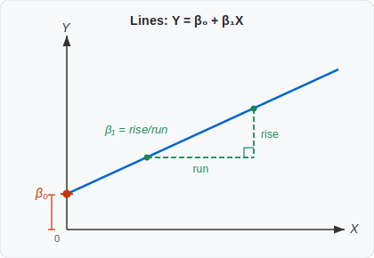
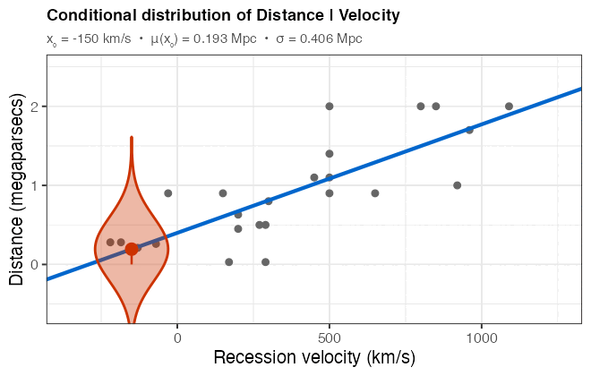

```{r}
#| label: setup
#| include: false
library(tidyverse)
library(broom)
library(patchwork)
knitr::opts_chunk$set(echo       = TRUE,
                      fig.height = 3,
                      fig.width  = 5,
                      fig.align  = "center")
ggplot2::theme_set(ggplot2::theme_bw())
```

# Learning Objectives

- Describe the simple linear regression model and interpret its parameters.
- Estimate regression coefficients using ordinary least squares (OLS).
- Conduct inference (tests and confidence intervals) for $\beta_0$ and $\beta_1$.
- Distinguish between pointwise confidence intervals, simultaneous confidence
  bands, and prediction intervals.
- Recognize the dangers of extrapolation.
- Interpret the sample correlation and $R^2$ as measures of linear association.

---

# Case Study: The Big Bang and the Age of the Universe

According to Big Bang theory, the distance $Y$ between any two celestial
objects and their recession velocity $X$ (the speed at which they are moving
apart) are related by the age of the universe $T$:
$$Y = TX.$$

Edwin Hubble measured recession velocities and distances for 24 nebulae beyond
the Milky Way. If the Big Bang model is correct, the slope of a regression of
Distance on Velocity estimates the age of the universe, and the intercept
should be zero.

```{r}
#| label: scatter
#| message: false
case0701 <- read_csv("https://dcgerard.github.io/stat_302/data/case0701.csv")
ggplot(case0701, aes(x = Velocity, y = Distance)) +
  geom_point() +
  labs(x = "Recession velocity (km/s)",
       y = "Distance (megaparsecs)")
```

**Questions of interest:**

- Is the intercept zero, as Big Bang theory requires?
- What is the estimated age of the universe?

---

# Review: Lines

Every straight line has the equation
$$Y = \beta_0 + \beta_1 X,$$
where $\beta_1$ is the **slope** (rise over run) and $\beta_0$ is the
**$y$-intercept** (the value of the line at $X = 0$).

{fig-align="center" width="65%"}

---

# The Simple Linear Regression Model

## Model

$$Y_i = \beta_0 + \beta_1 X_i + \varepsilon_i$$

- $Y_i$: response for observation $i$ (distance of nebula $i$ from Earth)
- $X_i$: explanatory variable for observation $i$ (recession velocity of nebula $i$)
- $\beta_0$: intercept of the mean line — the mean response when $X = 0$
- $\beta_1$: slope — the mean difference in $Y$ per one-unit difference in $X$
- $\beta_0 + \beta_1 X_i$: the **conditional mean** of $Y$ at $X = X_i$
- $\varepsilon_i$: individual noise, mean 0, variance $\sigma^2$, ideally
  normally distributed

## Conditional Distributions

The key assumptions are:

1. The **mean** of $Y$ is a linear function of $X$: $E(Y \mid X) = \beta_0 + \beta_1 X$.
2. The **variance** of $Y$ is the same for every value of $X$ (constant $\sigma^2$).
3. Individual observations are **independent**.
4. Ideally, $Y \mid X$ is **normally distributed**.

The animation below illustrates assumptions 1 and 2: at each fixed velocity $x_0$,
the distance values are normally distributed around the fitted line, and the
spread $\sigma$ is the same at every $x_0$.

{fig-align="center" width="70%"}

---

# Estimating $\beta_0$ and $\beta_1$: Ordinary Least Squares

## The OLS Criterion

We choose $\hat\beta_0$ and $\hat\beta_1$ to minimize the **sum of squared
residuals**:

$$\text{RSS} = \sum_{i=1}^{n} \hat\varepsilon_i^2
= \sum_{i=1}^{n} \bigl(Y_i - \hat\beta_0 - \hat\beta_1 X_i\bigr)^2.$$

The resulting estimates are called the **ordinary least squares (OLS)**
estimates.

## Visualizing OLS

Three candidate lines are shown below. The vertical segments are the residuals.
The OLS line has the smallest total squared length.

```{r}
#| label: ols-viz
#| echo: false
#| fig-width: 9
#| fig-height: 3
lmout <- lm(Distance ~ Velocity, data = case0701)

make_fit_plot <- function(b0, b1, label) {
  resid_df <- case0701 |>
    mutate(fitted = b0 + b1 * Velocity)
  ss <- round(sum((resid_df$Distance - resid_df$fitted)^2), 2)
  ggplot(resid_df, aes(x = Velocity, y = Distance)) +
    geom_segment(aes(xend = Velocity, yend = fitted), alpha = 0.5) +
    geom_point() +
    geom_abline(intercept = b0, slope = b1, color = "blue", alpha = 0.6) +
    ggtitle(paste0(label, "\nRSS = ", ss))
}

p1 <- make_fit_plot(1.2, 1 / 1310, "Poor fit")
p2 <- make_fit_plot(0.7, 1 / 1000, "Better fit")
p3 <- make_fit_plot(coef(lmout)[1], coef(lmout)[2], "OLS fit")

p1 | p2 | p3
```

## Closed-Form Solutions

Using calculus one can show that the OLS estimates are:

$$\hat\beta_1 = \frac{s_Y}{s_X}\, r_{XY},
\qquad
\hat\beta_0 = \bar Y - \hat\beta_1 \bar X,$$

where $s_X$, $s_Y$ are the sample standard deviations and $r_{XY}$ is the
sample correlation.

## Estimating $\sigma^2$

The residuals $\hat\varepsilon_i = Y_i - \hat\beta_0 - \hat\beta_1 X_i$
measure leftover variability. The estimated variance is:

$$\hat\sigma^2 = \frac{\sum_{i=1}^n \hat\varepsilon_i^2}{n - 2}
= \frac{\text{RSS}}{n - 2}.$$

We divide by $n - 2$ because two parameters ($\beta_0$ and $\beta_1$) are
estimated — leaving $\nu = n - 2$ degrees of freedom.

---

# Implementation in R

Use `lm()` (**l**inear **m**odel) to fit the regression:

```{r}
#| label: fit
lmout <- lm(Distance ~ Velocity, data = case0701)
```

`coef()` returns $\hat\beta_0$ and $\hat\beta_1$; `sigma()` returns $\hat\sigma$:

```{r}
#| label: coef-sigma
coef(lmout)
sigma(lmout)
```

Plot the fitted line with `geom_smooth(method = "lm")`:

```{r}
#| label: plot-fit
ggplot(case0701, aes(x = Velocity, y = Distance)) +
  geom_point() +
  geom_smooth(method = "lm", se = FALSE) +
  labs(x = "Recession velocity (km/s)", y = "Distance (megaparsecs)")
```

---

# Inference for Regression Coefficients

## Sampling Distributions

Because $\hat\beta_0$ and $\hat\beta_1$ depend on the random sample, they
have **sampling distributions**. If we repeatedly drew new samples (keeping
the $X_i$ values fixed) and re-estimated, the resulting estimates would vary.

```{r}
#| label: samp-dist-sim
#| echo: false
#| fig-width: 9
#| fig-height: 3
#| message: false
set.seed(1)
lmcoef <- coef(lmout)

sim_panel <- function(i) {
  sim_data <- case0701 |>
    mutate(newDist = lmcoef[1] + lmcoef[2] * Velocity +
             rnorm(n(), 0, sigma(lmout)))
  lmcoef2 <- coef(lm(newDist ~ Velocity, data = sim_data))
  ggplot(sim_data, aes(x = Velocity, y = newDist)) +
    geom_point(size = 0.8) +
    geom_abline(slope = lmcoef[2], intercept = lmcoef[1],
                color = "blue", alpha = 0.4, linewidth = 0.8) +
    geom_abline(slope = lmcoef2[2], intercept = lmcoef2[1],
                color = "red", linetype = "dashed") +
    ylim(-0.5, 2.5) +
    labs(x = "Velocity", y = "Distance",
         subtitle = paste0("Sample ", i))
}

(sim_panel(1) | sim_panel(2) | sim_panel(3))
```

Blue = true regression line; dashed red = estimated line from that simulated
sample. The slope shifts across samples, but centers on the true $\beta_1$.

The histograms below confirm that the sampling distributions of $\hat\beta_0$
and $\hat\beta_1$ are (approximately) normal:

```{r}
#| label: samp-dist-hist
#| echo: false
#| fig-width: 9
#| fig-height: 3
#| message: false
set.seed(1)
nrep <- 500
sims <- map_dfr(seq_len(nrep), function(i) {
  nd <- case0701 |>
    mutate(newDist = lmcoef[1] + lmcoef[2] * Velocity +
             rnorm(n(), 0, sigma(lmout)))
  co <- coef(lm(newDist ~ Velocity, data = nd))
  data.frame(beta0hat = co[1], beta1hat = co[2])
})

ph0 <- ggplot(sims, aes(x = beta0hat)) +
  geom_histogram(bins = 30, fill = "white", color = "black") +
  labs(x = expression(hat(beta)[0]), title = expression("Sampling distribution of " * hat(beta)[0]))

ph1 <- ggplot(sims, aes(x = beta1hat)) +
  geom_histogram(bins = 30, fill = "white", color = "black") +
  labs(x = expression(hat(beta)[1]), title = expression("Sampling distribution of " * hat(beta)[1]))

ph0 | ph1
```

## Theoretical Standard Errors

A CLT argument shows that for large $n$:

$$\hat\beta_1 \sim N\!\left(\beta_1,\; SE(\hat\beta_1)\right), \qquad
SE(\hat\beta_1) = \hat\sigma \sqrt{\frac{1}{(n-1)s_X^2}}$$

$$\hat\beta_0 \sim N\!\left(\beta_0,\; SE(\hat\beta_0)\right), \qquad
SE(\hat\beta_0) = \hat\sigma \sqrt{\frac{1}{n} + \frac{\bar X^2}{(n-1)s_X^2}}$$

## $t$-Tests

Replacing $\hat\sigma$ for $\sigma$ introduces extra variability, so the
standardized estimates follow a $t$ distribution:

$$t^* = \frac{\hat\beta_1 - \beta_1}{SE(\hat\beta_1)} \sim t_{n-2},
\qquad
t^* = \frac{\hat\beta_0 - \beta_0}{SE(\hat\beta_0)} \sim t_{n-2}.$$

To test $H_0 : \beta_1 = 0$ (no linear association), compute
$t^* = \hat\beta_1 / SE(\hat\beta_1)$ and find the two-sided $p$-value
$2 P(t_{n-2} \leq -|t^*|)$.

## Confidence Intervals

A 95% confidence interval for $\beta_1$:

$$\hat\beta_1 \pm t_{n-2}(0.975) \cdot SE(\hat\beta_1).$$

## Obtaining Results in R

`tidy()` from the `broom` package returns estimates, SEs, $t$-statistics, and
$p$-values as a tidy data frame:

```{r}
#| label: tidy-summary
tidy(lmout)
```

`tidy()` with `conf.int = TRUE` appends 95% confidence intervals:

```{r}
#| label: tidy-confint
tidy(lmout, conf.int = TRUE)
```

## Interpretation

**Randomized experiment:** A one-unit increase in $X$ *causes* a $\hat\beta_1$
unit change in the mean of $Y$.

**Observational study:** Populations that differ by one unit in $X$
differ by $\hat\beta_1$ units in $Y$ on average.

For the nebula data (observational): nebulae with a recession velocity 1 km/s
faster tend to be about 0.0014 megaparsecs farther from Earth
($p < 0.001$, 95% CI: 0.00090 to 0.0018).

---

# Interval Estimates at a Given $X_0$

## Pointwise Confidence Intervals

A **pointwise confidence interval** at $X_0$ estimates the *mean* response
$\beta_0 + \beta_1 X_0$:

$$\hat\beta_0 + \hat\beta_1 X_0 \;\pm\; t_{n-2}(0.975) \cdot
SE\!\left(\hat\beta_0 + \hat\beta_1 X_0\right),$$

where

$$SE\!\left(\hat\beta_0 + \hat\beta_1 X_0\right)
= \hat\sigma \sqrt{\frac{1}{n} + \frac{(X_0 - \bar X)^2}{(n-1)s_X^2}}.$$

In R, use `predict()` with `interval = "confidence"`:

```{r}
#| label: ci-predict
predict(lmout, newdata = data.frame(Velocity = 100),
        interval = "confidence")
```

`geom_smooth(method = "lm")` draws these pointwise intervals as a shaded band:

```{r}
#| label: ci-band
ggplot(case0701, aes(x = Velocity, y = Distance)) +
  geom_point() +
  geom_smooth(method = "lm", formula = y ~ x) +
  labs(x = "Recession velocity (km/s)", y = "Distance (megaparsecs)")
```

## Simultaneous Confidence Bands

A **simultaneous confidence band** captures the *entire* regression line at
once with 95% confidence:

$$\hat\beta_0 + \hat\beta_1 X_0 \;\pm\; \sqrt{2 F_{2,\,n-2}(0.95)}
\cdot SE\!\left(\hat\beta_0 + \hat\beta_1 X_0\right).$$

The wider multiplier $\sqrt{2 F_{2,n-2}(0.95)}$ replaces $t_{n-2}(0.975)$
to account for all values of $X_0$ simultaneously.

::: {.callout-note}
`geom_smooth()` draws **pointwise** intervals, not simultaneous bands. For
simultaneous bands, a third-party package such as `investr` is needed.
:::

## Prediction Intervals

A **prediction interval** gives likely values for a *future* observation at
$X_0$, not just the mean:

$$\hat\beta_0 + \hat\beta_1 X_0 \;\pm\; t_{n-2}(0.975)
\sqrt{\hat\sigma^2 + SE\!\left(\hat\beta_0 + \hat\beta_1 X_0\right)^2}.$$

The extra $\hat\sigma^2$ term accounts for individual variation around the
mean. Prediction intervals are always wider than confidence intervals.

::: {.callout-warning}
## Prediction intervals are sensitive to non-normality

Confidence intervals for the mean are protected by the central limit theorem.
Prediction intervals, which try to capture a single future observation, are
not — they rely directly on the normality assumption.
:::

```{r}
#| label: pred-interval
predict(lmout, newdata = data.frame(Velocity = 100),
        interval = "prediction")
```

## Comparing the Three Interval Types

```{r}
#| label: interval-comparison
#| echo: false
#| fig-width: 6
#| fig-height: 3
npoints  <- 100
newdf    <- data.frame(Velocity = seq(min(case0701$Velocity),
                                      max(case0701$Velocity),
                                      length = npoints))
ci_out   <- predict(lmout, newdata = newdf, interval = "confidence",
                    se.fit = TRUE)
pred_out <- predict(lmout, newdata = newdf, interval = "prediction",
                    se.fit = TRUE)
fmult    <- sqrt(2 * qf(0.95, df1 = 2, df2 = nrow(case0701) - 2))

newdf$Fit <- ci_out$fit[, 1]

banddf <- bind_rows(
  data.frame(Velocity = newdf$Velocity, Lower = ci_out$fit[, 2],
             Upper = ci_out$fit[, 3], Type = "Pointwise CI"),
  data.frame(Velocity = newdf$Velocity,
             Lower = newdf$Fit - fmult * ci_out$se.fit,
             Upper = newdf$Fit + fmult * ci_out$se.fit,
             Type = "Simultaneous band"),
  data.frame(Velocity = newdf$Velocity, Lower = pred_out$fit[, 2],
             Upper = pred_out$fit[, 3], Type = "Prediction interval")
) |>
  mutate(Type = factor(Type,
                       levels = c("Pointwise CI",
                                  "Simultaneous band",
                                  "Prediction interval")))

ggplot(case0701, aes(x = Velocity, y = Distance)) +
  geom_point(size = 1) +
  geom_line(data = newdf, aes(x = Velocity, y = Fit),
            linewidth = 0.8, color = "black") +
  geom_ribbon(data = banddf, aes(x = Velocity, ymin = Lower, ymax = Upper,
                                  color = Type), inherit.aes = FALSE,
              alpha = 0.25, fill = NA) +
  scale_color_manual(values = c("Pointwise CI"       = "#E69F00",
                               "Simultaneous band"  = "#56B4E9",
                               "Prediction interval"= "#009E73")) +
  labs(x = "Recession velocity (km/s)", y = "Distance (megaparsecs)",
       fill = NULL) +
  theme(legend.position = "bottom")
```

The prediction interval is widest; the pointwise confidence interval is
narrowest; and the simultaneous band falls between.

---

# Extrapolation vs. Interpolation

**Interpolation** means making estimates within the range of the observed $X$
values. **Extrapolation** means predicting outside that range. Extrapolation
is unreliable because:

1. The linear relationship may not hold beyond the observed range.
2. The variability may be different beyond the observed range.

```{r}
#| label: extrap-viz
#| echo: false
#| fig-width: 9
#| fig-height: 3
#| warning: false
x_interp <- 600
x_extrap <- 1700

p_in <- ggplot(case0701, aes(x = Velocity, y = Distance)) +
  geom_point() +
  geom_abline(slope = coef(lmout)[2], intercept = coef(lmout)[1],
              color = "#56B4E9", alpha = 0.6) +
  geom_segment(aes(x = x_interp, xend = x_interp, y = 0,
                   yend = coef(lmout)[1] + x_interp * coef(lmout)[2]),
               color = "#E69F00", linetype = "dashed") +
  ylim(0, 2.1) +
  ggtitle("Interpolation (safe)")

p_ex <- ggplot(case0701, aes(x = Velocity, y = Distance)) +
  geom_point() +
  geom_abline(slope = coef(lmout)[2], intercept = coef(lmout)[1],
              color = "#56B4E9", alpha = 1) +
  geom_segment(aes(x = x_extrap, xend = x_extrap, y = 0,
                   yend = coef(lmout)[1] + x_extrap * coef(lmout)[2]),
               color = "#E69F00", linetype = "dashed") +
  xlim(min(case0701$Velocity), 2000) +
  ylim(0, 3.2) +
  ggtitle("Extrapolation (risky)")

p_in | p_ex
```

---

# Correlation

The **sample correlation** measures the strength and direction of the *linear*
association between $X$ and $Y$:

$$r_{XY} = \frac{1}{n-1}
\sum_{i=1}^n \frac{(X_i - \bar X)(Y_i - \bar Y)}{s_X s_Y}.$$

Properties:

- Always between $-1$ and $1$.
- $r = 0$ means no *linear* association (but could be non-linear!).
- $|r| = 1$ if and only if all points lie exactly on a straight line.
- No units.

::: {.callout-warning}
## Always plot your data

Correlation measures only *linear* association. Very different datasets can
share the same correlation. The Anscombe quartet below all have $r \approx 0.82$:
:::

```{r}
#| label: anscombe
#| echo: false
#| fig-width: 9
#| fig-height: 9
data("anscombe")
pa1 <- ggplot(anscombe, aes(x = x1, y = y1)) + geom_point() +
  labs(title = "Dataset 1", x = "x", y = "y")
pa2 <- ggplot(anscombe, aes(x = x2, y = y2)) + geom_point() +
  labs(title = "Dataset 2", x = "x", y = "y")
pa3 <- ggplot(anscombe, aes(x = x3, y = y3)) + geom_point() +
  labs(title = "Dataset 3", x = "x", y = "y")
pa4 <- ggplot(anscombe, aes(x = x4, y = y4)) + geom_point() +
  labs(title = "Dataset 4", x = "x", y = "y")
(pa1 | pa2) / (pa3 | pa4)
```

In R, `cor()` computes the sample correlation:

```{r}
#| label: cor
cor(case0701$Velocity, case0701$Distance)
```

- Guess the correlation: <https://www.guessthecorrelation.com/>

---

# $R^2$

$R^2$ (the coefficient of determination) measures the **proportion of
variation in $Y$ explained by the regression line**:

$$R^2 = \frac{\text{Total SS} - \text{Residual SS}}{\text{Total SS}}
= \frac{\text{Regression SS}}{\text{Total SS}}.$$

The three components are shown below:

```{r}
#| label: r2-viz
#| echo: false
#| fig-width: 9
#| fig-height: 3
orange <- "#E69F00"
ybar   <- mean(case0701$Distance)
fitvec <- fitted(lmout)

seg_total <- data.frame(x = case0701$Velocity, xend = case0701$Velocity,
                        y = case0701$Distance, yend = ybar)
seg_resid <- data.frame(x = case0701$Velocity, xend = case0701$Velocity,
                        y = case0701$Distance, yend = fitvec)
seg_reg   <- data.frame(x = case0701$Velocity, xend = case0701$Velocity,
                        y = ybar, yend = fitvec)
line_df   <- data.frame(x = case0701$Velocity, y = fitvec)

make_r2_plot <- function(segs, title) {
  ggplot(case0701, aes(x = Velocity, y = Distance)) +
    geom_segment(data = segs,
                 aes(x = x, xend = xend, y = y, yend = yend),
                 color = "steelblue") +
    geom_point() +
    geom_hline(yintercept = ybar, linetype = "dashed",
               color = orange, linewidth = 0.8) +
    geom_line(data = line_df, aes(x = x, y = y),
              color = orange, linewidth = 0.8) +
    ggtitle(title)
}

pr1 <- make_r2_plot(seg_total, "Total variability")
pr2 <- make_r2_plot(seg_resid, "Residual variability")
pr3 <- make_r2_plot(seg_reg,   "Variability explained")

pr1 | pr2 | pr3
```

Properties of $R^2$:

- Close to 0: weak linear relationship.
- Close to 1: strong linear relationship.
- $R^2 = r_{XY}^2$ — the square of the sample correlation.
- Context-dependent benchmarks: $R^2 > 0.99$ is typical in physics;
  $R^2 \approx 0.25$–$0.5$ is considered good in social science.

`glance()` from `broom` returns model-level statistics including $R^2$:

```{r}
#| label: r2-glance
glance(lmout)
```

::: {.callout-warning}
## $R^2$ cannot diagnose model adequacy

Like correlation, $R^2$ measures only linear association. A high $R^2$ does
not mean the linear model is appropriate (see the Anscombe quartet above).
Always examine residual plots.
:::

---

# Back to the Big Bang

## Is the Intercept Zero?

The Big Bang model requires $\beta_0 = 0$. `tidy()` gives the test directly:

```{r}
#| label: test-intercept
tidy(lmout)
```

The $p$-value for $H_0 : \beta_0 = 0$ is well below 0.05, so we reject the
hypothesis that the intercept is zero. The nebula data are inconsistent with
the simple $Y = TX$ Big Bang model (or there is systematic measurement error).

## Estimating the Age of the Universe

If we nonetheless assume the Big Bang model and force $\beta_0 = 0$, we fit a
line through the origin with `- 1`:

```{r}
#| label: no-intercept-age
lm_noint <- lm(Distance ~ Velocity - 1, data = case0701)
cbind(estimate = coef(lm_noint), confint(lm_noint))
```

The estimated age is approximately 0.00192 megaparsec-seconds per km
(95% CI: 0.00153 to 0.00232). Converting to years gives an estimate of
roughly 1.9 billion years — far too young by modern standards (the universe is
approximately 13.8 billion years old), reflecting the limited accuracy of
Hubble's early distance measurements.


