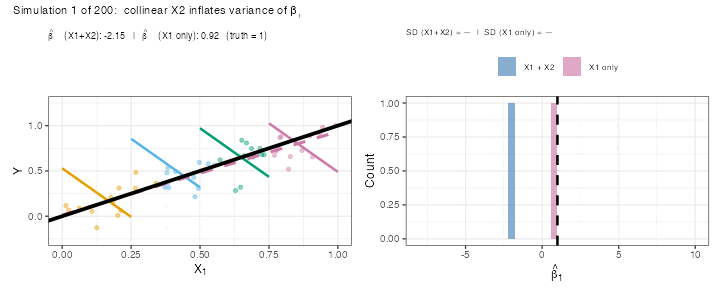

```{r}
#| label: setup
#| include: false
set.seed(16)
library(patchwork)
knitr::opts_chunk$set(echo       = TRUE,
                      fig.height = 3,
                      fig.width  = 5,
                      fig.align  = "center")
ggplot2::theme_set(ggplot2::theme_bw())
set.seed(1)
```

```{r}
#| label: load-packages
#| message: false
library(tidyverse)
library(broom)
library(GGally)
```

# Learning Objectives

- Follow a seven-step workflow for building a multiple regression model.
- Know the three goals of a regression analysis and how they shape model building.
- Understand the costs of including too few or too many variables.
- Apply backward stepwise regression using `step()`.
- Compare non-nested models with AIC and BIC.
- Conduct a final $F$-test to answer a primary research question after variable selection.
- Chapter 12 in the textbook.

---

# A Seven-Step Workflow

Building a multiple regression model is **iterative**, not a single pass.
Below is a structured workflow; Steps 3–5 are often repeated several times.

| Step | Action |
|:--:|:--|
| **1** | Identify your objective (inference, exploration, or prediction). |
| **2** | Screen available explanatory variables — keep relevant ones, drop near duplicates. |
| **3** | Exploratory data analysis: scatterplots of $Y$ vs each $X$, and of $X$'s vs each other. |
| **4** | Transform variables based on EDA (log, polynomial, etc.). |
| **5** | Fit a rich model; check residuals and influential observations. If problems remain, return to Step 3. |
| **6** | Variable selection: $F$-tests, stepwise regression, AIC/BIC. |
| **7** | Proceed with the final model: report estimates, confidence intervals, and $p$-values. |

The rest of this lecture covers Steps 1, 2, 6, and 7 in detail.
Steps 3–5 are covered in the EDA and assumptions lectures.

---

# Step 1: Goals of Analysis

Knowing your goal shapes every model-building decision.

## Goal 1: Inference About a Specific Variable

- You care about the association between **one** explanatory variable ($X_1$) and $Y$.
- Other variables are **confounders** you want to control for.
- Strategy: use variable selection (Step 6) to choose good controls; then add $X_1$ at the
  end and test it formally.
- Example: *"Is sex associated with salary, after adjusting for seniority, age, and education?"*

## Goal 2: Exploratory — Fishing for Associations

- No single variable of primary interest; you want to discover what matters.
- Iterate through adding/removing variables, checking residuals, refining transformations.
- **Warning**: $p$-values no longer have their usual meaning after variable selection.
  You have run many implicit tests; treat the model as descriptive, not confirmatory.

## Goal 3: Prediction

- You want to minimize prediction error for new observations.
- Interpretation of individual coefficients is secondary.
- Choose variables by predictive criteria (AIC, cross-validation), not by $p$-values.

---

# Step 2: Screen Available Variables

- List all explanatory variables relevant to your objective.
- **Drop** variables that are exact or near-exact linear combinations of others —
  they create numerical instability.
- **Note** pairs of variables you expect to be highly correlated.
  High correlation is not a reason to drop a variable on its own, but it will inflate
  standard errors (see below).
- Variables not included at this step will not be in the final model, so be inclusive
  rather than exclusive here.

---

# Steps 3--5

- Exploratory data analysis.
- Tons of scatterplots / Look at correlation coefficients.
  - [MLR EDA](../11_ch9/11_multiple_regression_eda.qmd)
- Transformations based on EDA.
  - [Linear Model Assumptions and Transformations](../10_ch8/10_ch8.qmd)
- Fit a rich model and look at residuals.
  - Look for curvature, non-constant variance, and outliers.
  - [Outliers](./12_outliers.qmd)
  - [Linear Model Assumptions and Transformations](../10_ch8/10_ch8.qmd)
  - [MLR EDA](../11_ch9/11_multiple_regression_eda.qmd)
- Iterate the above steps until you don’t see any issues. 

---

# Step 6: Variable Selection

## The Variable Selection Problem

Including too few or too many variables both hurt your analysis.

### Too Few Variables: Omitted Variable Bias

- When a confounder is omitted, the coefficient on $X_1$ absorbs its effect.
  This is called **omitted variable bias**.
- Example: men may appear to earn more than women, but the gap narrows once you control
  for job type, seniority, and experience.
- Omitting relevant variables also **widens prediction intervals**, because $\hat\sigma^2$
  absorbs the unexplained variation.

```{r}
#| label: pred-interval-demo
#| fig-width: 7
#| fig-height: 3
#| echo: false
set.seed(23)
n  <- 100
px <- runif(n)
py <- px + rnorm(n, sd = 0.1)

grid <- tibble(px = seq(0, 1, length.out = 200))

pred_with <- as_tibble(predict(lm(py ~ px), newdata = grid,
                                interval = "prediction")) |>
  bind_cols(grid) |>
  mutate(model = "With X (correct)")

pred_without <- as_tibble(predict(lm(py ~ 1), newdata = grid,
                                   interval = "prediction")) |>
  bind_cols(grid) |>
  mutate(model = "Without X (omitted)")

pred_both <- bind_rows(pred_with, pred_without)

ggplot(pred_both, aes(x = px, color = model, fill = model)) +
  geom_ribbon(aes(ymin = lwr, ymax = upr), alpha = 0.25, color = NA) +
  geom_line(aes(y = fit), linewidth = 1) +
  geom_point(data = tibble(px = px, py = py),
             aes(x = px, y = py), inherit.aes = FALSE,
             alpha = 0.4, size = 1) +
  scale_color_manual(values = c("steelblue", "tomato"), name = NULL) +
  scale_fill_manual(values  = c("steelblue", "tomato"), name = NULL) +
  labs(x = "X", y = "Y",
       title = "Omitting a relevant variable widens prediction intervals") +
  theme(legend.position = "top")
```

- The **shaded bands** are 95% prediction intervals.
- Omitting $X$ makes the prediction interval far wider because the model mistakes
  the variation explained by $X$ for unexplained noise.

### Too Many Variables: Multicollinearity

- When two explanatory variables are highly correlated, it is hard to separate their
  individual effects.
- The standard errors of both coefficient estimates inflate — estimates become unstable.
- **In any single dataset**, the estimated slope can be wildly off from the truth, even
  though the estimator is still unbiased on average.

#### Animation: Collinearity in Action

The true model is $\mu(Y \mid X_1) = X_1$ (slope = 1, no $X_2$ effect), but $X_1$ and
$X_2$ are nearly identical. Each frame below simulates a fresh dataset and fits the model
$Y \sim X_1 + X_2$:

- **Left**: points colored by $X_2$ quartile; colored segments show the fitted
  *adjusted* slope within each $X_2$ group; the **black line** is the truth (slope = 1).
- **Right**: the histogram of estimated $\hat\beta_1$ builds up across simulations.

```{r}
#| label: collinear-gif
#| echo: false
#| message: false
#| warning: false
#| eval: false
library(gifski)

set.seed(1)
n  <- 50
x1 <- runif(n)
x2 <- x1 + rnorm(n, sd = 0.01)     # nearly identical to x1

x2_q <- cut(
  x2,
  breaks         = quantile(x2, c(0, 0.25, 0.5, 0.75, 1)) + c(-0.001, 0, 0, 0, 0.001),
  labels         = c("Q1 (low X₂)", "Q2", "Q3", "Q4 (high X₂)"),
  include.lowest = TRUE
)
q_levels <- levels(x2_q)
q_means  <- tapply(x2, x2_q, mean)

n_sim <- 200
sim_results <- lapply(seq_len(n_sim), function(i) {
  set.seed(200 + i)
  y <- x1 + rnorm(n, sd = 0.15)
  list(y        = y,
       b_full   = coef(lm(y ~ x1 + x2)),  # collinear model
       b_simple = coef(lm(y ~ x1)))         # simple model
})

all_slopes_full   <- sapply(sim_results, function(r) r$b_full["x1"])
all_slopes_simple <- sapply(sim_results, function(r) r$b_simple["x1"])

cb_pal <- c("#E69F00", "#56B4E9", "#009E73", "#CC79A7")

tmp_dir   <- tempfile()
dir.create(tmp_dir)
png_files <- character(n_sim)

for (i in seq_len(n_sim)) {
  b_full   <- sim_results[[i]]$b_full
  b_simple <- sim_results[[i]]$b_simple
  y        <- sim_results[[i]]$y

  pt_df <- data.frame(x1 = x1, y = y, x2_q = x2_q)

  # X1+X2: parallel coloured segments, one per x2 quartile
  seg_df <- do.call(rbind, lapply(seq_along(q_levels), function(k) {
    q     <- q_levels[k]
    int_q <- b_full["(Intercept)"] + b_full["x2"] * q_means[q]
    x_lo  <- 0.25 * (k - 1);  x_hi <- 0.25 * k
    data.frame(x1 = c(x_lo, x_hi),
               y  = int_q + b_full["x1"] * c(x_lo, x_hi),
               x2_q = q)
  }))
  seg_df <- seg_df |>
    mutate(x2_q = factor(x2_q, levels = q_levels))

  # X1 only: single line across full range
  simple_df <- data.frame(x1 = c(0, 1),
                           y  = b_simple["(Intercept)"] + b_simple["x1"] * c(0, 1))

  p_left <- ggplot(pt_df, aes(x = x1, y = y, color = x2_q)) +
    geom_point(alpha = 0.45, size = 1.4) +
    geom_line(data = seg_df, aes(group = x2_q), linewidth = 1.0) +
    geom_line(data = simple_df, aes(x = x1, y = y), inherit.aes = FALSE,
              color = "#CC79A7", linewidth = 1.2, linetype = "dashed") +
    geom_abline(slope = 1, intercept = 0, color = "black", linewidth = 1.5) +
    scale_color_manual(values = cb_pal, name = NULL) +
    coord_cartesian(ylim = c(-0.25, 1.25)) +
    labs(x = expression(X[1]), y = "Y",
         subtitle = bquote(
           hat(beta)[1] ~ "(X1+X2):" ~ .(round(b_full["x1"], 2)) ~
           "  |  " ~
           hat(beta)[1] ~ "(X1 only):" ~ .(round(b_simple["x1"], 2)) ~
           "  (truth = 1)"
         )) +
    theme(legend.position = "none",
          plot.subtitle   = element_text(size = 8))

  hist_df <- data.frame(
    slope = c(all_slopes_full[seq_len(i)], all_slopes_simple[seq_len(i)]),
    model = factor(rep(c("X1 + X2", "X1 only"), each = i),
                   levels = c("X1 + X2", "X1 only"))
  )

  sd_full   <- if (i >= 2) sprintf("%.2f", sd(all_slopes_full[seq_len(i)]))   else "—"
  sd_simple <- if (i >= 2) sprintf("%.2f", sd(all_slopes_simple[seq_len(i)])) else "—"

  p_right <- ggplot(hist_df, aes(x = slope, fill = model)) +
    geom_histogram(binwidth = 0.4, alpha = 0.65,
                   position = "identity", color = NA) +
    geom_vline(xintercept = 1, linetype = "dashed", linewidth = 1) +
    scale_fill_manual(values = c("X1 + X2" = "steelblue", "X1 only" = "#CC79A7"),
                      name = NULL) +
    coord_cartesian(xlim = c(-8, 10)) +
    labs(x = expression(hat(beta)[1]), y = "Count",
         subtitle = paste0("SD (X1+X2) = ", sd_full,
                           "  |  SD (X1 only) = ", sd_simple)) +
    theme(legend.position = "top",
          legend.text     = element_text(size = 7.5),
          plot.subtitle   = element_text(size = 7.5))

  combined <- p_left + p_right +
    plot_annotation(
      title = paste0("Simulation ", i, " of ", n_sim,
                     ":  collinear X2 inflates variance of β̂₁"),
      theme = theme(plot.title = element_text(size = 10))
    )

  f <- file.path(tmp_dir, sprintf("frame_%03d.png", i))
  ggsave(f, combined, width = 8.5, height = 3.5, dpi = 85)
  png_files[i] <- f
}

gifski(png_files, gif_file = "collinear_demo.gif", delay = 0.1, loop = TRUE)
```

```{r}
#| label: show-gif
#| echo: false
#| message: false

```

- **Left panel**: colored segments are the $X_1$+$X_2$ adjusted slopes (one per $X_2$ quartile,
  all parallel — same $\hat\beta_1$); the **dashed pink line** is the $X_1$-only slope;
  the **solid black line** is the truth (slope = 1).
- **Right panel**: the pink ($X_1$ only) histogram builds into a tight spike near 1;
  the blue ($X_1$+$X_2$) histogram spreads widely across the $x$-axis.
- The SD values in the subtitle quantify the difference: including a near-duplicate $X_2$
  inflates the standard deviation of $\hat\beta_1$ by roughly a factor of 20 or more.
- The histogram shows that $\hat\beta_1$ is unbiased on average, but the variance is enormous.
- In practice you only have **one** dataset: your estimate could be anywhere in that histogram.

## Stepwise Regression

### The Idea

- **Backward elimination**: Start with the most complex model, remove the term whose
  removal most improves (or least worsens) a criterion, repeat.
- **Forward selection**: Start with intercept only, add the term that most improves the
  criterion, repeat.
- **Both directions**: Mix of adding and removing at each step.

### The `step()` Function

- `step()` in R uses **AIC** as its criterion: it accepts a step if AIC decreases.
- Smaller AIC = better model.
- `step()` returns an `lm` object — `tidy()`, `glance()`, `anova()` all work on it.

```{r}
#| label: bank-load
#| message: false
case1202 <- read_csv("https://dcgerard.github.io/stat_302/data/case1202.csv") |>
  mutate(logBsal = log(Bsal),
         Age2    = Age^2,
         Exper2  = Exper^2)
```

```{r}
#| label: bank-step
lm_rich <- lm(logBsal ~ Senior + Age + Age2 + Educ + Exper + Exper2,
              data = case1202)
lm_step <- step(lm_rich, trace = FALSE)
tidy(lm_step)
```

- `Age2` was dropped; everything else was retained.

### Warning: $p$-values After Stepwise

- $p$-values in the final model **cannot be interpreted at face value** after stepwise
  selection — you have implicitly run many tests.
- Use the selected model to describe the data or for prediction, not for formal inference
  about variables that were part of the selection process.
- **Exception**: a variable pre-specified as the primary interest (Goal 1) can still be
  tested formally after variable selection — see §"Final Inference" below.

## AIC and BIC

### When Can't We Use the $F$-test?

- The $F$-test requires the reduced model to be a **special case** of the full model
  (nested models).
- `logBsal ~ Senior + Educ + Exper + Exper2` vs `logBsal ~ Senior + Educ + Age + Age2`
  are **not** nested — neither is a special case of the other.
- For non-nested models we need a different comparison criterion.

### Formulas and Intuition

Both AIC and BIC penalize RSS for model complexity:

$$\text{AIC} = n \log\!\left(\frac{RSS}{n}\right) + 2(p + 1)$$

$$\text{BIC} = n \log\!\left(\frac{RSS}{n}\right) + \log(n)\,(p + 1)$$

- **Smaller is better** for both.
- $p$ = number of regression coefficients.
- **AIC**: lighter penalty → picks slightly larger models → prefer when **predicting**.
- **BIC**: heavier penalty (grows with $n$) → picks sparser models → prefer for
  **interpretation and inference**.
- Differences of less than ~2 units are negligible.

```{r}
#| label: aic-bic
lm_exper <- lm(logBsal ~ Senior + Educ + Exper + Exper2, data = case1202)
lm_age   <- lm(logBsal ~ Senior + Educ + Age   + Age2,   data = case1202)

bind_rows(
  glance(lm_exper) |> mutate(model = "Exper model"),
  glance(lm_age)   |> mutate(model = "Age model")
) |>
  select(model, AIC, BIC, r.squared, adj.r.squared)
```

- The **experience model** has lower AIC and BIC — preferred on both counts.

---

# Case Study: Sex Discrimination at a Bank

## Background

- Harris Trust and Savings Bank was sued for sex discrimination in the 1970s.
- 93 employees hired as clerical workers between 1969 and 1977.
- Response: `Bsal` — beginning salary (dollars).
- **Goal (Goal 1)**: Is sex associated with starting salary, after controlling for other variables?

| Variable | Description |
|:--|:--|
| `Bsal` | Beginning salary (dollars) |
| `Sex` | Male or Female |
| `Senior` | Seniority (months since hired) |
| `Age` | Age (months) |
| `Educ` | Education (years) |
| `Exper` | Prior work experience (months) |

## Steps 3–5: EDA

```{r}
#| label: bank-eda
#| fig-width: 7
#| fig-height: 6
#| message: false
#| warning: false
ggpairs(case1202,
        columns = c("logBsal", "Sex", "Senior", "Age", "Educ", "Exper"),
        aes(color = Sex, alpha = 0.5),
        upper = list(continuous = wrap("cor", size = 3)))
```

- `logBsal` is more symmetric than raw `Bsal`.
- Males start at higher salaries.
- `Age` and `Exper` are positively correlated ($r \approx 0.8$) — collinearity to watch.
- Quadratic terms for `Age` and `Exper` may be warranted given the scatter.

## Step 6: Variable Selection

`Sex` is the primary question — **exclude it from stepwise selection** and add it back
for the final test. Run stepwise on the control variables only:

```{r}
#| label: bank-step-controls
lm_rich_controls <- lm(logBsal ~ Senior + Age + Age2 + Educ + Exper + Exper2,
                        data = case1202)
lm_step_controls <- step(lm_rich_controls, trace = FALSE)
tidy(lm_step_controls)
```

- `Age2` was dropped; `Senior`, `Age`, `Educ`, `Exper`, `Exper2` were retained.

## Step 7: Final Inference on Sex

Add `Sex` to the stepwise-selected model and test it:

```{r}
#| label: bank-final
lm_final <- lm(logBsal ~ Sex + Senior + Age + Educ + Exper + Exper2,
               data = case1202)
tidy(lm_final, conf.int = TRUE)
```

```{r}
#| label: bank-sex-effect
tidy(lm_final, conf.int = TRUE) |>
  filter(term == "SexMale") |>
  mutate(across(c(estimate, conf.low, conf.high), exp))
```

- On the **log scale**: males start at $\hat\beta_{\text{Sex}} \approx 0.13$ log-dollars more.
- On the **original scale**: males start at $e^{0.13} \approx 1.14\times$ the salary of
  comparably qualified females — about **14% higher**.
- 95% CI for the multiplicative effect: roughly 1.09 to 1.19.
- **Conclusion**: We have very strong evidence that males received higher starting salaries
  than comparably qualified females ($p < 0.001$), even after adjusting for seniority, age,
  education, and experience.

---

# Exercises

**1.** Using the bank data, suppose we are only interested in whether **education** is
associated with log salary, after adjusting for other variables.

a. Fit a rich model (without `Sex`) that includes `Senior`, `Educ`, `Age`, `Age2`,
   `Exper`, and `Exper2`. Use `tidy()` to examine the coefficients.

b. Run `step()` on the rich model. Note whether `Educ` is kept or dropped.

c. Regardless of whether `step()` kept `Educ`, add it to the stepwise-selected model
   and test it with a $t$-test. State a conclusion in context. Why is this $p$-value
   interpretable, even after running `step()`?

---

**2.** Consider these three models fit to the bank data:

```r
lm_a <- lm(logBsal ~ Senior + Educ + Exper + Exper2, data = case1202)
lm_b <- lm(logBsal ~ Senior + Age  + Age2,            data = case1202)
lm_c <- lm(logBsal ~ Senior + Educ + Age  + Exper,    data = case1202)
```

a. Which pairs of models are nested? For any nested pair, set up and run an $F$-test.

b. For the non-nested pairs, compare AIC and BIC using `glance()`. Which model do you
   prefer, and why?

c. Do AIC and BIC agree? If they disagree, which criterion should you follow — and
   does the answer depend on the goal of the analysis?

---

**3.** A researcher fits a complex model and then runs `step()`, obtaining a simpler final
model. She reports the smallest $p$-value from `tidy()` on the final model as evidence of
a significant effect.

a. What is wrong with this approach?

b. Under what circumstances *can* a variable's $p$-value be interpreted normally, even
   after stepwise selection?

c. If the goal were **prediction**, would the researcher's approach be more or less
   problematic? Explain.
