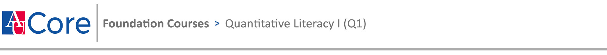

- **Instructor**: Dr. David Gerard
- **Email**: <dgerard@american.edu>
- **Office**: DMTI 106E

# Q1 Learning Outcomes:

{fig-alt="Q1 learning outcomes."}\ 

1. Students will solve quantitative problems including approaches that go beyond memorized procedures.

2. Students will demonstrate an understanding of mathematical relationships from multiple perspectives, such as functions from graphical, verbal, numerical, and analytic points of view.

# Q2 Learning Outcomes:

{fig-alt="Q2 learning outcomes."}\ 

1. Translate real-world questions or intellectual inquiries into quantitative frameworks.

2. Select and apply appropriate quantitative methods or reasoning.

3. Draw appropriate insights from the application of a quantitative framework.

4. Explain quantitative reasoning and insights using appropriate forms of representation so that others could replicate the findings.

# Course Description

This course builds on the basic tools of data analysis and methods of statistical inference. The course analyzes data from designed experiments and observational studies, formulates questions and interprets the results in the context of the statistical problem of interest. Emphasis is placed on determining the appropriate statistical model, understanding the assumptions of the model, assessing whether the data satisfies the assumptions, and improving the model if necessary. Topics covered include two‐sample t‐tests, nonparametric procedures, analysis of variance, and linear and logistic regression. Statistical software is integrated into the course for exploration, analysis, and demonstration of concepts. 

# Required Text
> Ramsey, F. L., Schafer, D. W. (2013). [*The Statistical Sleuth: A Course in Methods of Data Analysis*](https://wrlc-amu.primo.exlibrisgroup.com/permalink/01WRLC_AMU/1g8hf8s/alma99132367533604102), 3rd Edition. United Kingdom: Brooks/Cole, Cengage Learning.

- There will be occasional readings from other sources, such as journal articles, for class discussion or for homework assignments. These will be posted in Canvas or links will be given to find these online.

# Grading

- 10% Homework
- 10% Participation
  - Pretty standard stuff. Pay attention, come to class, answer questions.
  - I'll take of a percent each time I see you reading the news, on social media, playing video games, etc.
- 30% Final Project
- 50% Exams

Usual grade cutoffs will be used:
```{r, echo = FALSE}
curve_df <- data.frame(Grade = c("A", "A-", "B+", "B", "B-", "C+", "C", "C-", "D", "F"),
                       Lower = c(93, 90, 88, 83, 80, 78, 73, 70, 60, 0),
                       Upper = c(100, 92, 89, 87, 82, 79, 77, 72, 69, 59))
knitr::kable(curve_df)
```

Individual assignments will not be curved. However, at the discretion of the instructor, the overall course grade at the end of the semester may be curved.

# Grade Snapshots

Periodically, the professor may provide a grade snapshot that reflects the letter grade you would receive if final grades were assigned as of that day.

Please note the following:

- These are not final grade estimates. Final grades will be determined at the end of the semester and will incorporate all remaining assignments, examinations, and participation.
- A provisional grading curve could be applied to these snapshots for illustrative purposes. The final grading curve, if applied, may differ.
- Final grades are influenced by multiple factors, including your continued performance and the relative performance of your peers. For example, even if you maintain the same level of performance, improvements by others could affect your final grade. Consequently, your final grade may be higher or lower than the grade shown in these snapshots, perhaps significantly. 
- A value of "Excused" indicates that I did not provide a grade snapshot for you.

These snapshots are provided solely to indicate your current standing in the course and should not be interpreted as a guarantee or prediction of your final grade.

# Computing and Software

We will use the R computing language to complete some assignment questions. R is free and may be downloaded from the R website (<http://cran.r-project.org/>). In addition, I highly recommend you interface with R through the free RStudio IDE (<https://www.rstudio.com/>). R and RStudio are also available on computers in the Anderson Computing Complex in addition to various labs across campus. R Studio may also be run from your web browser using American University's [Virtual Applications System](https://americanuniversity.service-now.com/help/?id=sc_cat_item&sys_id=1fdf972fdbb3db00771cfce9af961985). Please see me during office hours if you have questions regarding R.

# Academic Integrity

Standards of academic conduct are set forth in the university’s [Academic Integrity Code](http://www.american.edu/academics/integrity/index.cfm). By registering for this course, students have acknowledged their awareness of the Academic Integrity Code and they are obliged to become familiar with their rights and responsibilities as defined by the Code. Violations of the Academic Integrity Code will not be treated lightly and disciplinary action will be taken should violations occur. This includes cheating, fabrication, and plagiarism.
    
No electronic resources are allowed for exams. If you touch your phone/computer/smart watch/smart glasses/etc during the exam then that is an automatic fail for the course.
    
All solutions that I provide are under my copyright. These solutions are for personal use only and may not be distributed to anyone else. Giving these solutions to others, including other students or posting them on the internet, is a violation of my copyright and a violation of the student code of conduct.

# Sharing Course Content: 

Students are not permitted to make visual or audio recordings (including livestreams) of lectures or any class-related content or use any type of recording device unless prior permission from the instructor is obtained and there are no objections from any student in the class. If permission is granted, only students registered in the course may use or share recordings and any electronic copies of course materials (e.g., PowerPoints, formulas, lecture notes, and any discussions – online or otherwise). Use is limited to educational purposes even after the end of the course. Exceptions will be made for students who present a signed Letter of Accommodation from the Academic Support and Access Center. Further details are available from the [ASAC website](https://www.american.edu/provost/academic-access/index.cfm).

# Use of Student Work

The professor will use academic work that you complete for educational purposes in this course during this semester. Your registration and continued enrollment constitute your consent.

# Syllabus Change Policy

This syllabus is a guide for the course and is subject to change with advanced notice. These changes may come via email or Canvas. Make sure to check Canvas and your university-supplied email regularly. You are accountable for all such communications.
